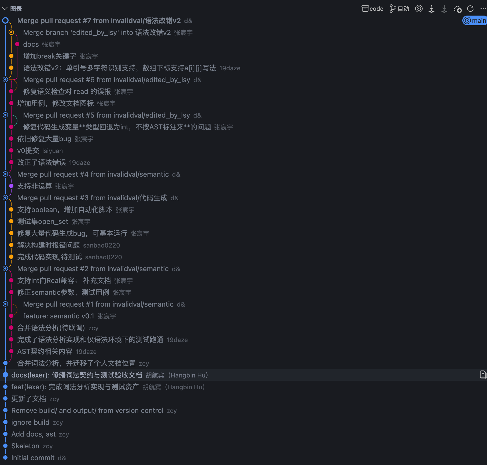

# 问题汇总及目前进度

日期：20260401
有关人员：李思远、谢康
时间安排：本周周末给出第一版修改，第六周应修完所有问题,*需要留时间跑平台测试和准备第八周集体汇报*
注意事项：**跨模块修改前需谨慎评估，必要时通知组长**

---

## 目前问题

目前仅剩代码生成模块存在问题，6个问题如下：

1. 字符生成问题：多字符如何生成C代码？
```bash
09_graph_coloring.c:3:17: warning: character constant too long for its type
    3 | const char ne = 'Not exist';
      |                 ^~~~~~~~~~~
09_graph_coloring.c:3:17: warning: overflow in conversion from 'int' to 'char' changes value from '2020176756' to '116' [-Woverflow]
09_graph_coloring.c: In function 'graphcoloring':
09_graph_coloring.c:66:6: error: expected ';' before '(' token
   66 | break();
      |      ^
      |      ;
0
```

2. scanf输入到函数时，&应该有吗？
```bash
14_union_find.c: In function 'getint':
14_union_find.c:18:13: error: lvalue required as unary '&' operand
   18 | scanf("%d", &getint());
      |             ^
0
```

3. 同2
```bash
15_matrix_multiply.c: In function 'getint':
15_matrix_multiply.c:31:13: error: lvalue required as unary '&' operand
   31 | scanf("%d", &getint());
      |             ^
0
```

4. 同1、2、3
```bash
22_math.c:3:20: warning: multi-character character constant [-Wmultichar]
    3 | const char split = '--';
      |                    ^~~~
22_math.c:3:20: warning: overflow in conversion from 'int' to 'char' changes value from '11565' to '45' [-Woverflow]
22_math.c: In function 'putfloat':
22_math.c:186:10: warning: format '%f' expects argument of type 'double', but argument 2 has type 'int' [-Wformat=]
  186 | printf("%f", f);
      |         ~^   ~
      |          |   |
      |          |   int
      |          double
      |         %d
22_math.c: In function 'getfloat':
22_math.c:192:13: error: lvalue required as unary '&' operand
  192 | scanf("%f", &getfloat());
      |             ^
189
```

5. 浮点结果错误（样例：xx_dct.c）
```bash
0.0000000.0000000.0000000.0000000.0000000.0000000.0000000.0000000.0000000.0000000.0000000.0000000.0000000.0000000.0000000.0000000.0000000.000000
```

预期：
```bash
18.1800000.874682-6.355848-0.000003-3.030000-1.676919-5.809019-2.5516041.474901-2.148832-0.1712391.1578140.1654270.166580-1.1704371.143870-0.833770-2.107450
```

6. 同5，xx_fp_params.pas
```bash
12.00000047.00000082.000000117.000000152.000000188.000000223.000000258.000000293.000000328.00000012.00000047.00000082.000000117.000000152.000000188.000000223.000000258.000000293.000000328.0000006.00000024.00000042.00000060.00000078.00000096.000000114.000000132.00000012.000000-6.000000
```
预期：
```bash
13.20000148.40000283.600006118.800003154.000000189.200012224.399994259.599976294.799988330.00000013.20000148.40000283.600006118.800003154.000000189.200012224.399994259.599976294.799988330.0000006.00000024.00000042.00000060.00000078.00000096.000000114.000000132.00000013.200001-7.200001
```

## 目前进度
1. 词法、语法分析完成，联调通过
2. 语义分析完成，词法、语法、语义联调完成
3. 头歌平台用例通过 89/95
4. 代码生成还存在问题，待修改后重新上传测试 

