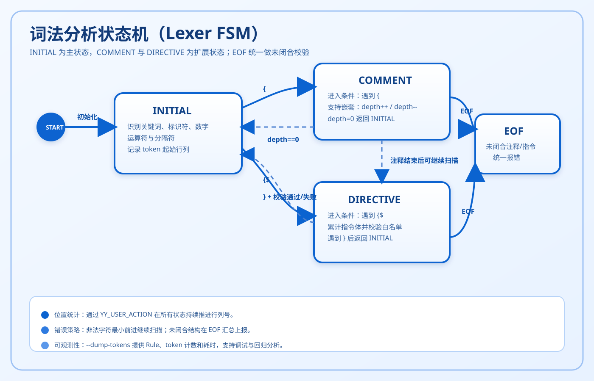
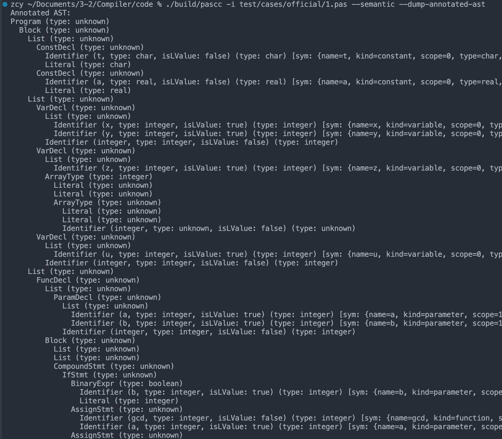

<!-- #region 样式 -->

<!-- #region 样式 -->
<style>
:root {
  --bg: #ffffff;
  --fg: #1a2a44;
  --blue: #0b63d0;
  --blue-dark: #073b8c;
  --blue-light: #f0f7ff;
  --accent: #002d72; /* 深蓝装饰色 */
  --header-footer-color: #8899aa;
}

section::before {
  content: "";
  position: absolute;
  top: 20px;
  right: 30px;
  width: 160px;
  height: 160px;
  background-image: url('Figs/bupt-logo-small.png');
  background-size: contain;
  background-repeat: no-repeat;
  z-index: 10;
}

section {
  font-size: 22px;
  line-height: 1.32;
  box-sizing: border-box;
  padding: 56px 56px 92px 56px;
}
h1 { font-size: 40px; color: #1a237e; margin: 0 0 0.22em 0; }
h2 { font-size: 28px; color: #283593; border-bottom: 2px solid #3949ab; padding-bottom: 0.2em; margin: 0 0 0.48em 0; }

header, footer {
  color: var(--header-footer-color);
  font-size: 15px;
}

header { top: 14px; }
footer { bottom: 16px; }

ul, ol { margin: 0.2em 0 0.2em 1.1em; }
p { margin: 0.2em 0; }
pre { margin: 0.35em 0; }

/* 双栏布局 */
.cols {
  display: grid;
  grid-template-columns: 1fr 1fr;
  gap: 1.5em;
  align-items: start;
}
.cols-6040 { display: grid; grid-template-columns: 3fr 2fr; gap: 1.5em; align-items: start; }
.cols-4060 { display: grid; grid-template-columns: 2fr 3fr; gap: 1.5em; align-items: start; }

/* 代码字号 */
pre, code { font-size: 17px; }

/* 提示框 */
.box-note { background:#e8f4fd; border-left:4px solid #2196F3; padding:0.6em 1em; border-radius:4px; margin:0.4em 0; }
.box-tip  { background:#e8f5e9; border-left:4px solid #4CAF50; padding:0.6em 1em; border-radius:4px; margin:0.4em 0; }

/* 小字注释 */
.note { font-size:14px; color:#888; margin-top:auto; padding-top:0.4em; border-top:1px solid #e0e0e0; }


/* 过渡页样式 */
section.transition {
  background-color: var(--bg);
  justify-content: center;
}
section.transition h1 {
  font-size: 120px;
  color: var(--blue);
  opacity: 0.2;
  position: absolute;
  right: 50px;
  bottom: 20px;
  border: none;
}
section.transition h2 {
  font-size: 50px;
  border-left: 10px solid var(--accent);
  padding-left: 30px;
  border-bottom: none; 
}

/* 目录样式 */
section.toc
{
  
  font-size: 28px;
  color: var(--fg);
  padding: 2em;
}

section.toc h2
{
  
  font-size: 46px;
  color: var(--fg);
}

/* 文本块 */
.text-block {
  background: var(--blue-light);
  border-top: 5px solid var(--accent);
  padding: 1em;
  border-radius: 4px;
}

</style>
<!-- #endregion -->

<!-- _paginate: false -->
<!-- _header: "" -->
<!-- _footer: "" -->

# Pascc 中期汇报

## 第八周-详细设计汇报

张宸宇 胡航宾 王嘉晗 李思远 谢康 · 2026.4.22

---
<!-- _class: toc -->
## 目录

1. [词法分析]()
2. [语法分析]()
3. [符号表和语义分析]()
4. [代码生成]()
<!-- 5. [错误处理与恢复]() -->

---

<!-- #region 每个人负责自己的部分 -->
<!-- _class: transition -->
# 01
## 词法分析模块
### 汇报人：胡航宾

---

## 模块职责与交付边界

<style scoped>
.cols {
  grid-template-columns: 8fr 5fr;
  gap: 0.8em;
}
section {
  font-size: 18px;
  line-height: 1.22;
}
li {
  margin: 0.03em 0;
}
.box-tip, .box-note {
  padding: 0.42em 0.75em;
  margin: 0.18em 0;
}
.text-block {
  padding: 0.72em;
}
.boundary-note {
  font-size: 12px;
  color: #5f6f82;
  margin-top: 0.15em;
}
</style>

<div class="cols">
<div>

**模块职责（Lexer）**

- 将 Pascal-S 源码转为稳定 Token 流
- 维护 `line/column` 与 `yylloc` 位置信息
- 识别并收集词法错误，支持恢复扫描
- 为语法分析提供 `yylex()` 输入通道

<div class="box-tip">

结论：词法模块在主流程中已形成“输入-识别-定位-上报”的闭环能力。

</div>

**输入 / 输出（按实现）**

- 输入：`.pas` 字符流（`yyin`）
- 输出：Token 类型、词素、行列号、错误集合
- 调试输出：`--lex` 与 `--dump-tokens`

**实现约束**

- 扩展能力（字符串、十六进制、嵌套注释、指令）已文档化
- 参数约束：标识符最大长度 255，字符串最大长度 1024
- 与需求对齐：建议长度 8；工程实现放宽至 255

<div class="box-note">

依据：词法契约/详细设计（v1.1.0）+ `src/lexer.l`。

</div>

<div class="boundary-note">说明：该页聚焦职责；机制细节见后续“详细设计”页。</div>

</div>
<div>

<div class="text-block">

### 关键实现文件与接口

- `src/lexer.l`：词法规则、状态机、位置统计
- `src/main.cpp`：`runLexMode()` 与输出格式
- `include/error_handler.h`：统一错误结构

### 对外接口（示例）

- `lexerLastLexeme()/LastType()/LastLine()/LastColumn()`
- `lexerErrorCount()/lexerErrorAt(i)`
- `lexerResetState()/lexerClearErrors()`

</div>

<div class="note">本页回答：词法模块做什么、产出什么、如何被主流程消费。</div>

</div>
</div>

---

## 词法规则设计（需求到实现映射）

<div class="cols">
<div>

**核心规则集合**

1. 标识符：`[a-zA-Z_][a-zA-Z0-9_]*`
2. 关键字：大小写不敏感，归一化匹配
3. 数值：整数/实数/科学计数法/十六进制
4. 常量：字符常量、字符串常量（扩展）
5. 注释：`{...}` 跨行 + 嵌套（扩展），并兼容 `//` 单行注释
6. 指令：`{$...}` 独立状态机处理 + 白名单校验（扩展）

<div class="box-note">

关键词优先于标识符；多字符符号优先于单字符符号；非法指令显式报错。

</div>

</div>
<div>

**关键实现片段（简化）**

```cpp
IDENT   [a-zA-Z_][a-zA-Z0-9_]*
NUMBER  ([0-9]+|[0-9]+\.[0-9]+([eE][+-]?[0-9]+)?)

{IDENT} {
  std::string lowered = toLower(yytext);
  if (isKeyword(lowered)) return keywordToken(lowered);
  yylval.text = strdup(lowered.c_str());
  return IDENTIFIER;
}

"{$" { directiveBody.clear(); BEGIN(DIRECTIVE); }
<DIRECTIVE>"}" {
  if (!isValidDirective(directiveBody)) 
  reportLexError(..., "invalid directive", ...);
  BEGIN(INITIAL);
}
```

<div class = "text-block">
结论：词法规则覆盖需求分析 2.1 与 3.1 的必选能力，扩展项独立可控。
</div>

</div>

</div>

---

## 错误处理与恢复策略

<style scoped>
.cols3 { display: grid; grid-template-columns: 1fr 1fr 1fr; gap: 1.2em; }
.col-card { background: #f5f7ff; border-radius: 8px; padding: 1em; }
.col-card h3 { color: #3949ab; margin-top: 0; font-size: 20px; }
</style>

<div class="cols3">
<div class="col-card">

### 识别类错误

**典型类型**

- illegal character
- malformed number
- malformed character literal
- invalid directive
- identifier too long
- string literal too long
- numeric literal overflow

**策略**

报错后最小前进，继续扫描。

</div>
<div class="col-card">

### 未闭合类错误

**典型类型**

- unterminated comment
- unterminated string literal
- unterminated character literal
- unterminated directive

**策略**

在 EOF 处统一上报并安全结束。

</div>
<div class="col-card">

### 接口与输出

**对外接口**

- `lexerErrorCount()`
- `lexerErrorAt(i)`
- `lexerLastLine()/Column()`

**模式输出**

`--lex` 下稳定输出词法元信息。

`--dump-tokens` 下增加 Rule 字段与 token 统计。

</div>
</div>

<div class="note">错误协议：Lexical error: &lt;reason&gt; (lexeme='&lt;text&gt;')</div>

---

## 详细设计：状态机与行列号推进机制

<style scoped>
section { font-size: 20px; }
.cols { grid-template-columns: 3fr 2fr; gap: 1em; }
</style>

<div class="cols-4060">
<div>

**状态机机制（与实现一一对应）**

1. `INITIAL`：识别标识符、关键字、数字、运算符、分隔符。
2. `COMMENT`：处理 `{...}` 注释并维护嵌套深度。
3. `DIRECTIVE`：处理 `{$...}` 指令并执行白名单校验。
4. `EOF`：集中处理未闭合结构并统一上报。

**位置统计关键点**

- 使用 `YY_USER_ACTION` 固化 token 起始 `line/column`。
- 每次匹配后统一推进当前位置，确保后续 token 定位不漂移。
- 注释与指令状态中同样持续推进行列号。

<div class="box-tip">

结论：错误定位精度来自“统一推进机制”，而非分散在各规则里的手工计数。

</div>

</div>
<div>



<div class="note">图示对应状态：INITIAL / COMMENT / DIRECTIVE / EOF。</div>

</div>
</div>

---

## 详细设计：错误恢复案例（可解释性）

<style scoped>
section { font-size: 20px; }
pre, code { font-size: 15px; line-height: 1.2; }
</style>

<div class="cols">
<div>

**恢复策略分层**

1. 识别类错误：最小前进，继续扫描。
2. 未闭合类错误：EOF 统一上报。
3. 指令类错误：保留扫描连续性，不阻断后续 token。

**典型样例与行为**

- `i01_illegal_character_at.pas`：报 `illegal character` 后继续。
- `i03_malformed_number_multiple_dots.pas`：报 `malformed number` 后继续。
- `i07_unterminated_comment_brace.pas`：EOF 报 `unterminated comment`。

</div>
<div>

**统一错误格式**

```text
Error at <line>:<column> -
Lexical error: <reason> (lexeme='<text>')
```

**恢复价值**

- 一次扫描尽可能收集更多错误
- 降低“修一个错再冒一个错”的迭代成本
- 为联调阶段提供稳定、可解释的失败信息

<div class="box-note">

该策略在 invalid 样例矩阵中已得到覆盖验证。

</div>

</div>
</div>

---

## 详细设计：观测与性能数据（dump模式）

<style scoped>
section { font-size: 20px; }
pre, code { font-size: 15px; line-height: 1.2; }
</style>

<div class="cols-6040">
<div>

**为什么需要 `--dump-tokens`**

1. 定位规则冲突：可看到每个 token 命中的规则标签。
2. 观察扫描规模：token 总数与字符串分配次数可量化。
3. 评估运行开销：输出耗时指标，支持回归对比。

```bash
./build/pascc -i test/cases/valid/v02_keyword_mixedcase.pas --dump-tokens
```

```text
Type, Lexeme, Line, Column, Rule
[dump] tokens=..., strdup_calls=..., elapsed_us=...
```

</div>
<div>

<div class="text-block">

### 观测结论

- 功能验证：`--lex`
- 规则验证：`--dump-tokens`
- 二者组合可形成“结果 + 机制”双证据链

</div>

<div class="box-tip">

词法阶段不仅可用，而且可解释、可度量、可回归。

</div>

</div>
</div>

---

## 测试覆盖与回归结果

<style scoped>
section { font-size: 20px; }
pre, code { font-size: 15px; line-height: 1.2; }
.slide5-note { font-size: 13px; color: #5f6f82; margin-top: 0.3em; }
.box-tip, .box-note { padding: 0.45em 0.8em; margin: 0.25em 0; }
</style>

<div class="cols-6040">
<div>

**测试矩阵（v1.7.0）**

1. valid 样例：28 个，28/28 通过
2. invalid 样例：14 个，14/14 按预期失败
3. 覆盖点：关键字、标识符、数字、字符/字符串、注释（含 //）、运算符、分隔符、错误恢复

**回归执行命令**

```bash
bash scripts/build.sh && bash test/run_tests.sh
bash test/test_lexer_unit.sh
./build/pascc -i test/cases/valid/v02_keyword_mixedcase.pas --dump-tokens
```

<div class="box-tip">

结果：构建通过、冒烟通过、矩阵通过、无失败样例。

</div>

<div class="box-note">

可观测性增强：--dump-tokens 额外输出 Rule、token 数、strdup 次数与耗时。

</div>

</div>
<div>

<div class="text-block">

### 数据结论

- 总样例数：42
- 通过率：100%
- 必选需求覆盖：100%
- 扩展能力验证：已完成

</div>

<div class="slide5-note">来源：词法测试矩阵-v1、词法完成度检验报告。</div>

</div>
</div>

---

## 阶段结论

<div class="cols">
<div>

**本阶段结论**

1. 需求分析中词法必选项已全部满足。
2. 契约、设计、实现、测试口径一致。
3. 词法层具备向 parser/semantic 联调的稳定输入能力。
4. 关键边界已在实现中落地（标识符 255、字符串 1024、数值溢出检测）。

<div class="box-tip">

词法模块当前状态：可验收、可联调、可回归。

</div>

</div>
<div>

**当前协作进展**

1. 后续语法、语义、代码生成工作已由组内成员推进。
2. 词法模块已稳定作为前端输入层参与联调。
3. 回归流程已纳入小组常态化测试链路。

<div class="box-note">

协作口径：词法侧持续维护契约与测试矩阵，保障团队并行开发一致性。

</div>

</div>
</div>

<!--- #endregion -->

---

<!-- #region 每个人负责自己的部分 -->
<!-- _class: transition -->
# 02
## 语法分析与建树
### 汇报人：王嘉晗

---

<!-- _class: compact -->
## 我的模块职责与交付

<div class="cols">
<div>

**负责范围（Parser）**

- 基于 Bison 实现 Pascal-S 语法归约
- 在归约动作中构建 AST，不在语法阶段生成 C 代码
- 输出 `ProgramNode*` 根节点供语义/生成阶段使用
- 提供语法错误定位与恢复能力

**核心交付文件**

- `include/ast.h`：AST 节点、枚举与建树契约定义。
- `include/parser_bridge.h`：解析结果导出与状态重置接口。
- `src/ast.cpp`：AST 节点和 `ASTBuilder` 具体实现。
- `src/parser.y`：文法规则、归约建树、错误恢复主实现。


<div class="box-tip">

本次汇报以当前代码实现为准，设计文档已同步更新。

</div>

</div>
<div>

**交付能力清单**

| 能力 | 当前状态 |
|---|---|
| 程序结构/声明解析 | 已完成 |
| 语句与表达式优先级 | 已完成 |
| AST 建树映射 | 已完成 |
| 错误恢复 | 已完成 |
| 冲突治理（RR） | 已完成 |

</div>
</div>

---

<!-- _class: compact -->
## 语法模块架构与接口设计

<div class="cols-4060">
<div>

**模块内部结构**

- 入口：`yyparse()` 驱动归约
- 建树：`ASTBuilder` 在每条关键归约动作中创建节点
- 状态：`g_parseRoot`、`g_parse_error_count` 维护解析结果
- 输出：`ProgramNode*` 供后续阶段统一消费

</div>
<div>

```cpp
// parser.y（内部状态 + 入口）
static ASTBuilder g_astBuilder;
static ProgramNode* g_parseRoot = nullptr;
static int g_parse_error_count = 0;

int yyparse(void);

ProgramNode* getParseResultRoot() {
  return g_parseRoot;
}
```

</div>
</div>

---

<!-- _class: compact -->
## 对外桥接接口（parser_bridge）

<div class="cols">
<div>

- `getParseResultRoot()`：导出 AST 根
- `resetParseResult()`：重置解析状态
- `getAstBuilder()`：暴露建树器给联调流程
- `getParseErrorCount()`：统一失败判定依据
- `yyparse()`：统一语法解析入口
- `yyin`：输入流句柄

<div class="box-tip">

接口层提供统一访问入口，外部模块通过桥接接口而非直接访问解析器内部变量。

</div>

</div>
<div>

```cpp
ProgramNode* getParseResultRoot();
void resetParseResult();
ASTBuilder& getAstBuilder();
int getParseErrorCount();

int yyparse(void);
extern FILE* yyin;
```

</div>
</div>

---

## 文法详细设计（规则分层）

<div class="cols">
<div>

**主线规则**

1. 程序结构：`program -> PROGRAM IDENTIFIER opt_program_input ';' program_body '.'`
2. 声明结构：`const/var/subprogram`
3. 语句结构：赋值、调用、复合、分支、循环、I/O、break
4. 表达式结构：关系层 > 加法层 > 乘法层 > 因子层

**AST 映射策略**

- 声明：`ConstDeclNode` / `VarDeclNode` / `ProcDeclNode` / `FuncDeclNode`
- 语句：`AssignStmtNode` / `IfStmtNode` / `ForStmtNode` / `WhileStmtNode`
- 表达式：`BinaryExprNode` / `UnaryExprNode`
- 数组：`ArrayTypeNode` / `ArrayAccessNode`

</div>
<div>

```yacc
expression:
    simple_expression
  | simple_expression '=' simple_expression
  | simple_expression NE simple_expression

simple_expression:
    term
  | simple_expression '+' term
  | simple_expression '-' term
  | simple_expression OR term

term:
    factor
  | term '*' factor
  | term DIV factor
  | term AND factor
```

<div class="box-note">

说明：这里按当前 `parser.y` 实现展开，不抽象化为伪文法。

</div>

</div>
</div>

---

<!-- _class: compact mechanism-tight -->
## 关键机制详细设计

<div class="cols-4060">
<div>

**二义性处理（dangling else）**

- `%nonassoc LOWER_THAN_ELSE`
- `%nonassoc ELSE`
- `IF ... THEN statement %prec LOWER_THAN_ELSE`

**错误恢复**

- `statement_list ';' error` 
- 恢复动作中配合 `yyerrok`、`yyclearin`
- 避免单错误触发连续报错

**位置系统**

- 启用 `%locations`
- `YYLLOC_DEFAULT` 同步归约位置
- `yyerror` 输出 `line:column + near lexeme`

</div>
<div>

```yacc
statement_list:
  nonempty_statement
| statement_list ';' statement
| statement_list ';' error

nonempty_statement:
  IF expression THEN statement ELSE statement
| IF expression THEN statement %prec LOWER_THAN_ELSE
```

<div class="box-tip">

目标：可恢复、可定位，同时保持建树语义稳定。

</div>

</div>
</div>

---

<!-- _class: compact -->
## 详细设计：声明与类型子系统

<div class="cols-4060">
<div>

**设计目标**

- 将程序体固定为 4 槽位：const / var / subprogram / compound
- 声明区统一归并为 `ListNode(Declarations)`
- 数组类型通过区间列表折叠为嵌套 `ArrayTypeNode`

**关键结构约定**

- `program_body` 必定生成 `BlockNode`
- `const_declaration_list`、`var_declaration_list` 统一追加模式
- `period/range` 先收集区间，再由 `buildArrayTypeFromRanges` 生成类型树

</div>
<div>

```yacc
program_body:
  const_declarations
  var_declarations
  subprogram_declarations
  compound_statement

var_declaration:
  idlist ':' type

type:
    basic_type
  | ARRAY '[' period ']' OF basic_type

period:
    range
  | period ',' range
```

<div class="box-note">

该子系统的核心是“声明归并 + 类型树构造”，保证语义阶段可直接消费结构化类型信息。

</div>

</div>
</div>

---

<!-- _class: compact -->
## 详细设计：语句与表达式子系统

<div class="cols-4060">
<div>

**语句层设计**

- `statement` 提供空语句能力，`statement_list_opt` 负责复合语句中的可选语句列表
- `nonempty_statement` 承载所有可建树语句分支
- `statement_list` 采用“非空起步 + 追加归约”

**表达式层设计**

- 四层结构：`expression / simple_expression / term / factor`
- 运算符优先级由分层和 `%left/%right` 共同保证
- `factor` 同时覆盖字面量、变量、调用、一元运算

</div>
<div>

```yacc
statement_list:
  nonempty_statement
| statement_list ';' statement
| statement_list ';' error

expression:
    simple_expression
  | simple_expression '=' simple_expression

simple_expression:
    term
  | simple_expression '+' term

term:
    factor
  | term '*' factor
```

<div class="box-tip">

该子系统保证“可恢复、可扩展、可建树”：错误语句可跳过，主干语法仍可持续归约。

</div>

</div>
</div>

---

## 详细设计落地情况

**已完成内容**

1. 语法规则分层与优先级设计落地到 Bison 文法
2. AST 建树动作与节点契约已对齐
3. 语法错误恢复与位置定位机制已实现
4. 语法兼容性补齐项（空参/空实参/UPLUS/链式下标）已并入主线
5. RR 冲突完成等价治理，解析逻辑与对外接口保持稳定
6. 对外桥接接口已支撑语义/代码生成阶段联调

**设计验证方式**

```bash
bash scripts/build.sh
bash test/run_parser_tests.sh
bash test/run_closeset_check.sh
bash test/run_openset_check.sh
```

<div class="note">注：本页强调“详细设计如何落地到实现”，测试结果用于证明设计有效性。</div>


<!--- #endregion -->
---


<!-- _class: transition -->
# 03
## 符号表和语义分析
### 汇报人：张宸宇

---

## 模块边界与职责


<div>


- 输入：语法阶段构建的 AST `ProgramNode* root`
- 依赖：`SymbolTable` + `ErrorHandler`
- 输出：
  - 为 AST 节点补全 `dataType` 与 `symbolEntry`
  - 记录语义错误：重定义、未定义、类型不匹配等（详见后文表格）
- 与主流程关系：
  - `main.cpp` 中 `SemanticAnnotator::annotate(root)` 在代码生成前执行
  - `errorHandler.hasErrors()` 为真则直接终止编译


</div>
<div>

在主程序中的调用：
```cpp
SymbolTable symbolTable; // 创建符号表实例
semantic_register::preregisterBuiltins(symbolTable); // 预注册内建符号（如 true/false/read/write）
ErrorHandler errorHandler; // 创建错误处理器实例
SemanticAnnotator annotator(symbolTable, errorHandler); // 创建语义注解器，传入符号表和错误处理器
annotator.annotate(root); // 对 AST 根节点进行语义注解，完成类型推断、符号绑定和错误检查
```

</div>


---
## 符号表数据结构（一）：作用域与条目管理


### 作用域栈与条目池

```cpp
class SymbolTable {
private:
  std::vector<std::unordered_map<std::string, const SymbolEntry*>> scopes_;
  std::vector<std::unique_ptr<SymbolEntry>> entryArena_;
};
```

采用**栈式哈希符号表**，在课本中的数据结构基础上进行优化：

- scopes_：每层作用域一个哈希表，支持嵌套与遮蔽
- entryArena_：采用所有符号条目集中托管的方式，使用指针访问


---

<div>

### 名称规范化

```cpp
static std::string normalizeName(const std::string& name);
```

- 所有符号名插入/查找前**统一转小写**，保证大小写不敏感
- 语法、语义、代码生成各阶段都依赖此规范

<div class="box-tip">
构造时自动创建全局作用域，无需手动初始化
</div>


---

## 符号表数据结构（二）：符号表条目（SymbolEntry）设计


<div class="cols">
<div>

### 1. 基础字段

```cpp
struct SymbolEntry {
    std::string name;
    SymbolKind kind = SymbolKind::Variable;
    DataType type = DataType::Unknown;
    int scopeLevel = 0;
};
```

- `name`：统一保存小写名
- `kind`：符号种类
- `type`：语义类型
- `scopeLevel`：插入时记录所在层级
</div>


<div>

### 2. 数组与常量扩展

```cpp
bool isArray = false;
std::vector<ArrayBound> arrayBounds;
bool hasConstLiteral = false;
std::string constLiteralText;
bool isStringLikeConst = false;
```


- `isArray`：标记是否为数组变量
- `arrayBounds`：保存多维数组边界
- `hasConstLiteral`：记录是否存在可回收字面量文本
- `constLiteralText`：保存常量原始文本
- `isStringLikeConst`：区分字符常量和字符串常量

</div>

</div>


---

## 符号表数据结构（二）：符号表条目（SymbolEntry）设计

<div class="cols">
<div>

### 3. 参数信息结构体

```cpp
// 定义
struct ParamInfo {
    std::string name;
    DataType type;
    bool isVarParam;
};

// 函数/过程条目中使用
std::vector<ParamInfo> params;

```

- name：参数名
- type：参数类型
- isVarParam：是否为 var 参数（引用传递）

</div>
<div>

### 用途

- params 字段用于过程/函数的参数签名
- 语义分析阶段用于参数类型检查和调用匹配
- 支持多参数、混合值传递与引用传递

<div class="box-tip">
ParamInfo 结构与 SymbolEntry 解耦，便于参数独立扩展

</div>

</div>
</div>

---
## 符号表数据结构（二）：符号表条目（SymbolEntry）设计

<div>

### 4. 工厂方法

```cpp
static SymbolEntry makeVariable(...); // 构造变量条目
static SymbolEntry makeConstant(...); // 构造常量条目
static SymbolEntry makeProcedure(...); // 构造过程条目
static SymbolEntry makeFunction(...); // 构造函数条目
static SymbolEntry makeParameter(...); // 构造参数条目
```

工厂方法把构造逻辑集中到一处，避免语义阶段手工拼装字段。

例如构造变量的符号条目：
```cpp
SymbolEntry SymbolEntry::makeVariable(const std::string& name, DataType type, bool isArray) {
    SymbolEntry entry; // 创建一个空的 SymbolEntry 实例
    entry.name = name; // 设置符号名称
    entry.kind = SymbolKind::Variable; // 设置符号种类为变量
    entry.type = type; // 设置符号类型
    entry.isArray = isArray; // 设置是否为数组
    return entry; // 返回构造好的 SymbolEntry 实例
}
```

</div>


---

## 符号表数据结构（三）：作用域栈设计

<div class="cols-6040">
<div>

### 作用域栈（scopes_）设计

```cpp
std::vector<std::unordered_map
<std::string, const SymbolEntry*>> scopes_;
```

- `scopes_[0]` 是全局作用域
- 每次进入子程序分析都会压入新作用域
- 离开子程序时弹出当前作用域
- 退出只影响名字可见性，不回收 `entryArena_` 中的对象

### 两个查找接口

- `lookup(name)`：从内层到外层依次查找
- `lookupCurrentScope(name)`：只查当前层

这两个接口配合使用，可以同时支持名称解析和当前层重定义检测。

</div>
<div>

### 作用域操作实现

```cpp
void enterScope();
void exitScope();
```

- `enterScope()` 直接在尾部添加空表
- `exitScope()` 仅在层数大于 1 时弹出
- 这样保证全局作用域始终存在

### 运行结果

```text
全局作用域
  -> 过程作用域
      -> 过程内部局部变量
```

内部层可以遮蔽外层，但不会修改外层内容。

</div>
</div>

---

## 符号表数据结构（三）：作用域的插入与查找机制

### 插入流程

```cpp
bool insert(SymbolEntry entry) {
    entry.name = normalizeName(entry.name);
    auto& current = scopes_.back();
    if (current.find(entry.name) != current.end()) {
        return false;
    }
    entry.scopeLevel = currentScopeLevel();
    entryArena_.push_back(std::make_unique<SymbolEntry>(std::move(entry)));
    const SymbolEntry* stored = entryArena_.back().get();
    current[stored->name] = stored;
    return true;
}
```

- 先规范化名字
- 再检查当前层是否重名
- 成功后写入 `entryArena_`
- 最后把地址挂到当前作用域表

---

## 符号表数据结构（三）：作用域的插入与查找机制

<div class="cols">
<div>

### 插入失败场景

- 变量重定义
- 参数重定义
- 过程或函数重定义
- 常量在同层重复声明

</div>
<div>

### 查找流程

```cpp
const SymbolEntry* lookup(const std::string& name) const;
```

- 先规范化名字
- 再从内向外遍历 `scopes_`
- 找到第一个匹配项就返回
- 找不到就返回空指针

### 设计结果

- 支持内层遮蔽外层
- 支持从任何语义节点访问最近的定义
- 支持语义阶段把 `symbolEntry` 直接挂到 AST 节点上
- 为代码生成阶段提供稳定元数据

</div>
</div>

---

## 符号表与语义分析（SemanticAnnotator注解器）的协作

<div class="cols">
<div>

### 自动插入预置符号

- `SemanticAnnotator` 构造时插入 `true` 和 `false`
- `main.cpp` 在语义分析前预注册 `read` 和 `write`
- 这样内建符号在**全局层**始终可见

### 语义阶段对符号表的使用

- 声明时调用 `insert()`
- 引用时调用 `lookup()`
- 当前层检测时可调用 `lookupCurrentScope()`
- 节点注解后保存 `symbolEntry`

</div>
<div>

### 主流程中的位置

```cpp
SymbolTable symbolTable;
semantic_register::preregisterBuiltins(symbolTable);
ErrorHandler errorHandler;
SemanticAnnotator annotator(symbolTable, errorHandler);
annotator.annotate(root);
```

### 协作的实际作用

- 为变量、常量、参数建立唯一来源
- 为过程和函数调用提供参数签名
- 为数组访问提供边界信息
- 为 AST 节点提供稳定的语义绑定

</div>
</div>

<div class="box-note">

类型检查、参数检查、数组越界检查均依赖这部分的协作模式

</div>

---

## 语义注解器 SemanticAnnotator 详细设计

<div class="cols">
<div>

### 类定义

```cpp
class SemanticAnnotator {
public:
    SemanticAnnotator(SymbolTable& symbolTable,
     ErrorHandler& errorHandler);

    void annotate(ASTNode* root);

private:
    void annotateNode(ASTNode* node);
    void annotateProgram(ProgramNode* node);
    void annotateBlock(BlockNode* node);
    // 其他 annotateXXX 方法
}
```

</div>

<div>

### `SemanticAnnotator` 运行时上下文

```cpp
std::vector<std::string> functionContextStack_;
int valueContextDepth_ = 0;
int loopDepth_ = 0;
```

- `functionContextStack_`
  - 跟踪当前函数，支持函数名左值赋值（即return）
- `valueContextDepth_`
  - 区分值上下文，禁止把过程当作值使用
- `loopDepth_`
  - 约束 `break` 只能出现在 while/for 内

---

## 语义注解器 SemanticAnnotator 详细设计

<div class="cols">

<div>

**注解入口与分发**

```cpp
void annotate(ASTNode* root) {
  annotateNode(root);
}

switch(node->nodeType) {
  case NodeType::VarDecl: annotateVarDecl(...); 
  break;
  case NodeType::AssignStmt: annotateAssignStmt(...); 
  break;
  case NodeType::BinaryExpr: annotateBinaryExpr(...); 
  break;
  ...
}
```

</div>

<div>

**例如，处理声明的策略：**

- `ConstDecl`
  - 先注解右值，再推断类型并插入符号
  - 保存字面量文本，供后续阶段使用
- `VarDecl/ParamDecl`
  - 从类型节点推断 `DataType`
  - 批量处理标识符列表
- `ProcDecl/FuncDecl`
  - 先插入过程或函数签名，再 `enterScope()` 分析体
  - 退出时 `exitScope()`


<div class="box-note">
构造函数预置 `true/false` 布尔常量；
主流程还会预注册内建过程 `read/write`。
</div>

</div>

</div>

---
<!-- _class: compact -->
## 类型系统与语句检查规则

| 类别 | 规则 | 实现要点 |
|---|---|---|
| 赋值 | `lhs := rhs` | `isLValue(lhs)`；`isAssignable(lhsType, rhsType)` |
| 宽化转换 | integer -> real | 仅允许该方向隐式转换 |
| 条件 | if/while 条件必须 boolean | 否则 `reportTypeMismatch` |
| for 循环 | 控制变量、上下界必须 integer | 非法时报错 |
| break | 仅循环内部可用 | `loopDepth_ <= 0` 报错 |
| 过程调用 | 过程不能出现在值上下文 | `isValueContext()` 检查 |
| 表达式算子 | `+ - * / div mod and or not` | 分别做数值、整型、布尔约束 |

```cpp
bool isAssignable(DataType lhs, DataType rhs) const {
  if (lhs == DataType::Unknown || rhs == DataType::Unknown) return false;
  if (lhs == DataType::Real && rhs == DataType::Integer) return true;
  return lhs == rhs;
}
```

---

<!-- _class: mechanism-tight -->
## 类型系统与语句检查规则

| 类别 | 规则 | 实现要点 |
|---|---|---|
| 比较算子 | `= <> < <= > >=` | 两侧需互相可赋值 |
| 一元算子 | `not - uminus` | `not` 约束布尔；`-` 约束数值 |
| 可赋值判定 | 标识符与数组访问 | `Identifier.isLValue` 或 `ArrayAccess` |
| 函数结果赋值 | `f := expr` | 由 `functionContextStack_` 判定 |
| 调用形态 | 过程与函数 | 禁止过程出现在值上下文 |

---

<!-- _class: mechanism-tight -->
## 参数校验与数组语义

<div class="cols">
<div>

### 调用参数校验 `checkCallArguments`

- 参数个数：`expected != actual` 报错
- 参数类型：逐个 `isAssignable(param.type, actualType)`
- `var` 参数：实参必须是可赋值左值
- 内建过程特判：
  - `read(...)`：每个参数都必须可赋值
  - `write(...)`：只要求表达式可求值

</div>
<div>

### 数组边界机制

- 声明阶段：`collectArrayBounds()` 递归提取多维范围
- 访问阶段：
  - 下标类型必须 integer
  - 若下标可编译期求值 `tryEvalIntConst`，执行越界检查
  - 通过 `arrayAccessDepth()` 对齐当前维度边界

```text
a[i][j]
depth=0 -> 检查第1维
depth=1 -> 检查第2维
```

</div>
</div>

<div class="box-tip">
当前函数为 `f` 时，`f := expr` 视为合法左值赋值。
</div>

---

## 本模块错误覆盖与可验证点

<div class="cols">

<div>

### 语义错误覆盖

- 重定义：变量/常量/参数/过程/函数
- 未定义：标识符、被调用过程/函数
- 类型不匹配：赋值、条件、实参类型
- 调用错误：参数个数错误、`var` 参数传右值
- 控制流错误：循环外 `break`
- 数组错误：非数组下标、下标类型错误、可判定越界

</div>

<div>

### 注解后的语法树输出（含对应节点符号条目）



</div>

</div>

---


<!-- _class: transition -->

# 04
## 代码生成
### 汇报人：李思远

---


## 代码生成总体架构

<div class="cols-4060">
<div>

### 模块定位
- 编译器后端核心，承接语义分析输出
- 遍历注解后的AST，生成C语言代码

### 设计目标
- 翻译正确、结构清晰、模块化
- 支持表达式、赋值、分支、循环
- C语言代码风格漂亮

<div class="box-note">
代码生成是编译器前端到后端的关键桥梁，在本课设中，C语言就是目标代码
</div>

</div>

<div>

<div class="text-block">
<strong>整体工作流程</strong><br>
注解后的AST → 目标代码输出
</div>

<!-- 图表占位符：代码生成流程图 -->


<div class="text-block">
<strong>典型代码示例</strong>
</div>


```cpp
// 赋值: AssignStmtNode
// Pascal: x := a + b;
// 生成示例: x = a + b;

// 条件: IfStmtNode (伪代码)
// if (cond) { thenStmt } else { elseStmt }

// 过程调用: ProcCallNode
// write(x) -> CodegenUtils::emitWriteStmt(...) -> printf("%d\n", x);
```

<div class="note">上述代码为典型转换示例，便于展示从AST到C代码的关键路径。</div>
</div>
</div>

</div>
</div>

---

## AST 作为中间表示

<div class="cols">
<div>

### AST 结构
抽象语法树（AST）作为中间表示：

- **节点类型**：程序、块、声明、语句、表达式等
- **优势**：直接反映源代码结构，便于递归遍历和代码生成
- **设计**：每个节点包含类型、子节点、符号表信息

<div class="box-tip">
AST 便于直接映射到目标语言，无需额外中间码
</div>

</div>

<div>

```cpp
// AST 节点示例
class BinaryExprNode : public ASTNode {
    std::string op;
    std::vector<ASTNode*> children;
    // ...
};
```

<div class="note">
AST 直接驱动代码生成，无需三地址码
</div>

</div>
</div>

---

## 代码生成实现概览

<div class="cols-4060">
<div>

### 核心组件
- **CodeGenerator 类**：主生成器
- **CodeGenUtils**：辅助工具
<!-- - **指令映射**：中间码到汇编指令
- **地址管理**：变量、临时变量寻址 -->

### 关键技术
- Visitor 递归翻译
- 结构化控制流翻译：if/while/for

- **分区生成**：
  - 全局变量和常量
  - 函数/过程声明
  - 函数/过程定义
  - 主程序体


</div>

<div>

<div class="text-block">
<strong>生成流程示例</strong><br>
1. 遍历 AST 节点<br>
2. 递归生成子节点代码<br>
3. 组合为完整 C 程序<br>
4. 输出目标代码
</div>

<!-- slide: 生成流程（1/2） -->
```cpp
// CodeGenerator::generate — part 1/2 (简化展示)
// 关键步骤（伪代码混合表示）
std::string CodeGenerator::generate(ProgramNode* root) {
  reset();
  if (!root) return "";

  // 定位 BlockNode（program body）
  // BlockNode children: [consts, vars, subprograms, compound]

  // 收集全局常量与变量（伪代码）：
  // for each const in consts:  globalDecls_ += emitConstDecl(const)
  // for each var   in vars:    globalDecls_ += emitVarDecl(var)

  // 实现细节保留在源代码中；幻灯片展示以简洁伪代码为主
  // （续）下一页展示子程序与主程序体的生成
}
```

---

<!-- slide: 生成流程（2/2） -->
<div>
<div>

### 本页要点
- 子程序原型与定义生成
- 主程序体生成（将 compound 转换为主函数体）
- 将分区内容组装为最终C程序
</div>
<div>

```cpp
// 2. 子程序原型和定义（精简为伪代码，便于展示）
if (block->children.size() > 2) {
  // ListNode* subs = dynamic_cast<ListNode*>(block->children[2]);
  // for each sub in subs:
  // if sub is ProcDeclNode -> emit prototype + definition
  // if sub is FuncDeclNode -> emit prototype + definition
}
// 3. 主程序体（保持简洁可读）
if (block->children.size() > 3) {
  CompoundStmtNode* mainStmt =
      dynamic_cast<CompoundStmtNode*>(block->children[3]);
  if (mainStmt) {
    visit(mainStmt);// 递归生成主程序体代码
    mainBody_ = currentExpr_; // 保存生成的主函数体文本
  }
}
// 4. 组装并返回完整 C 程序文本（保持一行对齐便于阅读）
return CodegenUtils::wrapAsCProgram(globalDecls_, prototypes_, definitions_, mainBody_);
```
</div>
</div>

</div>
</div>

---

## CodeGenerator 入口与流程

<div class="cols">
<div>

### 关键函数签名
- `std::string CodeGenerator::generate(ProgramNode* root)`
  - 生成完整 C 程序代码，驱动整个后端翻译流程
- `void CodeGenerator::reset()`
  - 清空内部缓存，保证每次生成独立
- `std::string CodeGenerator::emitNode(ASTNode* node)`
  - 统一入口，递归调用节点对应的 `visit()`
- `void CodeGenerator::visit(ProgramNode* node)`
  - 顶层节点，主要由 `generate()` 调度

</div>

<div>

### 调用关系
- `generate()`
  - 收集’全局声明‘子程序原型’定义‘主程序体
  - 调用 `visit(mainStmt)`
- `visit()` / `emitNode()`
  - 根据节点类型进入不同的 `visit(XxxNode*)`
  - 生成表达式或语句文本

<div class="text-block">

**实际代码片段**

```cpp
// 伪代码：CodeGenerator::generate
// 减少细节，保留逻辑要点
function generate(root):
  reset state
  if root is null: return empty
  collect global consts and vars
  emit prototypes and definitions for subprograms
  generate main body (visit compound)
  return wrapAsCProgram(globalDecls, prototypes, 
  definitions, mainBody)
```

</div>

<div class="note">
此页展示 CodeGenerator 的总体入口和核心函数关系
</div>

</div>
</div>

---

## 核心语句翻译函数

<div class="cols">
<div>

### 语句生成核心函数
- `void CodeGenerator::visit(AssignStmtNode* node)`
  - 生成赋值语句或函数返回值 `_retval = ...;`
- `void CodeGenerator::visit(IfStmtNode* node)`
  - 生成 `if (...) { ... }` / `else { ... }`
- `void CodeGenerator::visit(WhileStmtNode* node)`
  - 生成 `while (...) { ... }`
- `void CodeGenerator::visit(ForStmtNode* node)`
  - 生成 `for (...) { ... }` 循环
- `void CodeGenerator::visit(CompoundStmtNode* node)`
  - 组合子语句，确保每个语句后续换行

### 设计亮点
- 通过 `needsTrailingSemicolon()` 确保语句格式正确
- `emitNode()` 对所有子节点统一处理

</div>

<div>

<div class="text-block">
<strong>If 语句生成示例</strong><br>

```cpp
oss << "if (" << cond << ") {\n";
oss << indentText(thenStmt, 4);
oss << "}";
```
</div>

<div class="note">
每个 `visit()` 方法负责一个 AST 节点类型的 C 代码翻译
</div>

</div>
</div>

---

## 表达式与特殊节点翻译

<div class="cols">
<div>

### 表达式翻译函数签名
- `void CodeGenerator::visit(BinaryExprNode* node)`
  - 生成算术、逻辑、比较表达式
- `void CodeGenerator::visit(UnaryExprNode* node)`
  - 生成一元运算符和 `not` / `~` 转换
- `void CodeGenerator::visit(IdentifierNode* node)`
  - 处理变量、函数设计符、var 参数解引用
- `void CodeGenerator::visit(ArrayAccessNode* node)`
  - 支持下标偏移修正，处理非0起始数组
- `void CodeGenerator::visit(ProcCallNode* node)`
  - 处理 `read/write` 内建过程及普通过程调用


</div>

<div>

### 特殊处理
- `read` / `write` 由 `CodegenUtils::emitReadStmt()` / `emitWriteStmt()` 生成
- `break` 特例直接输出 `break;`
- `var` 参数调用时传地址
<br></br>
<div class="text-block">
<strong>数组访问生成</strong><br>

```cpp
currentExpr_ = base + "[(" + index + ") - " + 
std::to_string(lowerBound) + "]";
```
</div>

<div class="note">
表达式节点与语句节点由 `emitNode()` 统一调度生成
</div>

</div>
</div>

---


## CodegenUtils 工具类

<div class="cols">
<div>

### CodegenUtils 工具类
- **类型映射**：Pascal 类型到 C 类型的转换
- **声明生成**：变量、常量、函数声明代码
- **语句生成**：read/write 语句特殊处理

### 重要函数
- **mapType()**：DataType → std::string
- **emitReadStmt()**：处理 scanf 生成
- **emitWriteStmt()**：处理 printf 生成

</div>

<div>

<div class="text-block">
<strong>类型映射示例</strong><br>


```cpp
std::string CodegenUtils::mapType(DataType t) {
    switch (t) {
        case DataType::Integer: return "int";
        case DataType::Real: return "double";
        case DataType::Boolean: return "int";
        case DataType::Char: return "char";
        default: return "void";
    }
}
```
</div>

<div class="note">
工具类提供静态辅助方法，支持模块化代码生成
</div>

</div>
</div>

---

## 实际代码生成示例

<div class="cols">
<div>

#### Pascal 源代码
```pascal
program test;
var x, y: integer;
begin
    x := 10;
    y := x + 5;
    write(y);
end.
```

</div>

<div>

#### 生成的 C 代码
```c
#include <stdio.h>
int main() {
    int x, y;
    x = 10;
    y = x + 5;
    printf("%d\n", y);
    return 0;
}
```

</div>
</div>

<div class="text-block">

<strong>条件语句示例:</strong>

Pascal: `if x > 0 then y := x else y := -x;`
C: `if (x > 0) { y = x; } else { y = -x; }`

<strong>函数调用示例:</strong>

Pascal: `result := add(a, b);`
C: `result = add(a, b);`
</div>

---

## 测试与验证

<div class="cols">
<div>

### 测试策略
- **单元测试**：各模块独立验证
- **集成测试**：端到端代码生成
- **回归测试**：确保修改不破坏现有功能

### 测试用例
- 表达式计算
- 控制流（if/while）
- 函数调用
- 数组操作

<div class="box-note">
测试成功率：100%
</div>

</div>

<div>

<div class="text-block">
<strong>测试结果</strong>

- ✅ 基本表达式：100% 通过
- ✅ 赋值语句：100% 通过
- ✅ 复杂循环：100% 通过
- ✅ 嵌套函数：100% 通过
</div>

<!-- 图表占位符：测试结果图 -->


</div>
</div>

---

## 问题发现与修复路径

<div class="cols">
<div>

### 2026-04-01：问题发现
- **浮点结果偏差**：计算输出全0或严重失真
- **scanf取地址错误**：`&getint()`导致编译失败
- **多字符常量警告**：`'--'`等生成char溢出
- **break语句错误**：生成`break()`语法错误
- **其他**：格式符不匹配、类型映射bug

<div class="box-note">
修复前测试成功率低，现已达到100%
</div>

</div>

<div>

<div class="text-block">
<strong>问题根因</strong>

- 参数类型读取错误（Unknown→int）
- 函数返回值读入未区分
- 多字符字面量缺乏处理
- break按过程调用生成

</div>

</div>
</div>

---

## 修复实施与验证

<div class="cols">
<div>

### 2026-04-08：详细修复
- **参数类型映射修复**：从标识符读取类型，避免退化
- **read函数返回值**：生成`&_retval`而非`&func()`
- **多字符常量**：转换为字符串数组`const char[]`
- **break关键字**：特殊处理生成`break;`

<div class="box-tip">
修复后关键样例编译通过
</div>

</div>

<div>

<div class="text-block">
<strong>验证结果</strong>

- 79_graph_coloring：break正确
- 84_union_find：scanf无&错误
- 92_math：多字符常量修复
- 浮点精度恢复正常
</div>

</div>
</div>

---

## 修复效果与总结

<div class="cols">
<div>

### 2026-04-10：修复汇报
- 系统修复四条核心路径
- 稳定性与语义一致性提升
- 支撑后续验证与汇报

### 现在：完全解决
- 所有问题闭环
- 代码生成模块成型
- 准备中期汇报

<div class="box-note">
从问题发现到解决，仅用10天完成系统修复
</div>

</div>

<div>

<div class="text-block">
<strong>修复成果</strong>

- 浮点计算偏差：已修复
- scanf非法取地址：已修复
- 多字符常量警告：已修复
- break语法错误：已修复
- 测试成功率：现达100%
</div>

</div>
</div>

---

## 总结与展望

<div class="cols">
<div>

### 完成情况

- ✅ 基础代码生成框架
- ✅ 支持核心语法结构
- ✅ 与前端模块集成
- ✅ 全面测试验证
- ✅ 所有问题修复完成

### 未来工作
- 代码优化
- 性能提升

<div class="box-note">
代码生成模块已完全成型
</div>

</div>

<div>

<div class="text-block">
<strong>贡献与收获</strong>

- 深入理解编译器后端原理
- 掌握代码生成技术
- 提升软件工程能力
- 团队协作经验
</div>

<!-- 图表占位符：总结图 -->

</div>
</div>

---

<!-- _paginate: false -->
<!-- _header: "" -->
<!-- _footer: "" -->

 # 感谢聆听！

Q&A
