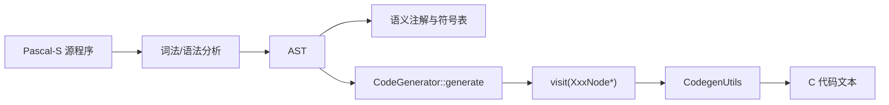

<!-- #region 样式（李思远代码生成部分） -->
<style>
.lsy {
  --bg: #ffffff;
  --fg: #1a2a44;
  --blue: #0b63d0;
  --blue-dark: #073b8c;
  --blue-light: #f0f7ff;
  --accent: #002d72;
  --header-footer-color: #8899aa;
}

.lsy section::before {
  content: "";
  position: absolute;
  top: 20px;
  right: 30px;
  width: 160px;
  height: 160px;
  background-image: url('Figs/bupt-logo-small.png');
  background-size: contain;
  background-repeat: no-repeat;
  z-index: 10;
}

.lsy section {
  font-size: 24px;
  line-height: 1.4;
}
.lsy h1 { font-size: 42px; color: #1a237e; }
.lsy h2 { font-size: 30px; color: #283593; border-bottom: 2px solid #3949ab; padding-bottom: 0.3em; }
.lsy h3 { font-size: 26px; color: #283593; }
.lsy h4 { font-size: 22px; color: #283593; }

.lsy .cols {
  display: grid;
  grid-template-columns: 1fr 1fr;
  gap: 1.8em;
  align-items: start;
}

.lsy .cols-6040 { display: grid; grid-template-columns: 3fr 2fr; gap: 1.8em; align-items: start; }
.lsy .cols-4060 { display: grid; grid-template-columns: 2fr 3fr; gap: 1.8em; align-items: start; }

.lsy pre, .lsy code {
  font-size: 20px;
  line-height: 1.5;
}

.lsy .box-note { 
  background:#e8f4fd; 
  border-left:4px solid #2196F3; 
  padding:0.8em 1.2em; 
  border-radius:6px; 
  margin:0.5em 0; 
}
.lsy .box-tip  { 
  background:#e8f5e9; 
  border-left:4px solid #4CAF50; 
  padding:0.8em 1.2em; 
  border-radius:6px; 
  margin:0.5em 0; 
}

.lsy .note { 
  font-size:15px; 
  color:#888; 
  margin-top:auto; 
  padding-top:0.5em; 
  border-top:1px solid #e0e0e0; 
}

.lsy .text-block {
  background: var(--blue-light);
  border-top: 5px solid var(--accent);
  padding: 1.2em;
  border-radius: 6px;
  font-size: 20px;
  line-height: 1.4;
}

.lsy.transition {
  background-color: var(--bg);
  justify-content: center;
}
.lsy.transition h1 {
  font-size: 120px;
  color: var(--blue);
  opacity: 0.2;
  position: absolute;
  right: 50px;
  bottom: 20px;
  border: none;
}
.lsy.transition h2 {
  font-size: 50px;
  border-left: 10px solid var(--accent);
  padding-left: 30px;
  border-bottom: none; 
}

</style>
<!-- #endregion -->

<!-- _paginate: false -->
<!-- _header: "" -->
<!-- _footer: "" -->


<!-- _class: lsy transition -->
# 04
## 代码生成
### 汇报人：李思远

---

<!-- _class: lsy -->
## 代码生成总体架构

<div class="cols">
<div>

### 模块定位
- 编译器后端核心，承接语义分析后的 AST
- 目标是生成等价 C 代码文本
- 与符号信息联动处理类型、数组边界与参数语义

### 设计目标
- 语义等价：保持 Pascal-S 语义
- 结构清晰：声明区/原型区/定义区/主程序区分离
- 可扩展：新增节点可通过 `visit(XxxNode*)` 接入

<div class="box-note">
当前实现为 AST 直接生成 C，不经过三地址码或汇编层
</div>

</div>

<div>

<div class="text-block">
<strong>整体工作流程</strong><br>
Pascal-S AST + 符号信息 → Visitor 递归翻译 → C 程序文本
</div>

<div class="cols-4060">
<div>


</div>

<div>
<div class="text-block">
<strong>实现对齐点</strong>
</div>


```cpp
// 入口：CodeGenerator::generate(root)
// 分区：globalDecls_ / prototypes_ / definitions_ / mainBody_
// 封装：CodegenUtils::wrapAsCProgram(...)
```

<div class="note">流程图与代码结构均来自详细设计第9章和 src/code_generator.cpp。</div>
</div>
</div>

</div>
</div>

---

<!-- _class: lsy -->
## AST 作为中间表示

<div class="cols">
<div>

### AST 结构
抽象语法树（AST）作为中间表示：

- **节点类型**：程序、块、声明、语句、表达式等
- **优势**：直接反映源代码结构，便于递归遍历和代码生成
- **设计**：节点含 `nodeType/dataType/children/symbolEntry`

<div class="box-tip">
AST 便于直接映射到目标语言，无需额外中间码
</div>

</div>

<div>

```cpp
// AST 节点示例
class BinaryExprNode : public ASTNode {
    std::string op;
    std::vector<ASTNode*> children;
    // ...
};
```

<div class="note">
代码生成通过 `emitNode()` 调用节点 `accept()`，再分派到对应 `visit()`
</div>

</div>
</div>

---

<!-- _class: lsy -->
## CodeGenerator 主流程（1/2）

<div class="cols">
<div>

### 核心步骤
- `reset()` 清空缓存
- 从 `ProgramNode` 中定位 `BlockNode`
- 收集全局常量和变量声明
- 为后续子程序与主程序体生成做准备

### 关键字段
- `globalDecls_`
- `prototypes_`
- `definitions_`
- `mainBody_`

</div>

<div>

<div class="text-block">
<strong>生成流程示例</strong><br>
1. 生成前置声明区<br>
2. 生成子程序原型与定义<br>
3. 生成主程序体<br>
4. 封装为完整 C 程序
</div>

```cpp
// CodeGenerator::generate（前半）
std::string CodeGenerator::generate(ProgramNode* root) {
  reset();
  if (!root) return "";

  // BlockNode children: [consts, vars, subprograms, compound]
  // 收集 const / var 到 globalDecls_
}
```

---
<!-- _class: lsy -->

## CodeGenerator 主流程（2/2）

<div class="cols-6040">
<div>

### 本页要点
- 子程序原型与定义生成
- 主程序体生成（`visit(CompoundStmtNode*)`）
- 分区组装为最终 C 程序文本
</div>
<div>


```cpp
// CodeGenerator::generate（后半）
if (block->children.size() > 2) {
  // ProcDeclNode: emitProcPrototype + emitProcDecl
  // FuncDeclNode: emitFuncPrototype + emitFuncDecl
}

// 主程序体
if (block->children.size() > 3) {
  CompoundStmtNode* mainStmt =
      dynamic_cast<CompoundStmtNode*>(block->children[3]);
  if (mainStmt) {
    visit(mainStmt);
    mainBody_ = currentExpr_;
  }
}

// 组装返回
return CodegenUtils::wrapAsCProgram(globalDecls_, prototypes_, definitions_, mainBody_);

```
</div>
</div>

<!-- _class: lsy -->
---

## 语句翻译（1/2）

<div class="cols">
<div>

### 主要函数
- `visit(AssignStmtNode*)`
- `visit(IfStmtNode*)`
- `visit(WhileStmtNode*)`
- `visit(ForStmtNode*)`
- `visit(CompoundStmtNode*)`

### 设计细节
- `needsTrailingSemicolon()` 控制是否补分号
- `indentText()` 统一缩进格式
- `CompoundStmt` 顺序拼接并自动换行

</div>

<div>

<div class="text-block">
<strong>If 生成示例</strong><br>


```cpp
oss << "if (" << cond << ") {\n";
oss << indentText(thenStmt, 4);
oss << "}";
```
</div>

<div class="note">
`IfStmt/WhileStmt/ForStmt` 都采用“头部 + 块体缩进 + 结束括号”的模板
</div>

</div>
</div>
<!-- _class: lsy -->

---

## 语句翻译（2/2）

<div class="cols">
<div>

### 关键语义点
- 函数结果赋值：`f := expr` 生成为 `_retval = expr;`
- `for` 支持 `to/downto`，比较符和步进符按方向切换
- `break` 由 `visit(BreakStmtNode*)` 生成 `break`
- 过程调用在语句上下文由分号规则补齐

### `for` 生成片段
- `to`：`<=` 与 `++`
- `downto`：`>=` 与 `--`

</div>

<div>

<div class="text-block">
<strong>For 语句生成示例</strong><br>

```cpp
std::string cmp = node->isDownto ? ">=" : "<=";
std::string step = node->isDownto ? "--" : "++";
oss << "for (" << iter << " = " << init << "; "
    << iter << " " << cmp << " " << end
    << "; " << iter << step << ") {\n";
```
</div>

<div class="note">
以上逻辑与 src/code_generator.cpp 中 `visit(ForStmtNode*)` 一致
</div>

</div>
<!-- _class: lsy -->
</div>

---

## 表达式与调用翻译（1/2）

<div class="cols">
<div>

### Binary/Unary 映射
- `mod -> %`
- `div -> /`
- `= -> ==`，`<> -> !=`
- `and -> &&`，`or -> ||`
- `not`：布尔为 `!`，整型为 `~`

### Identifier 处理
- `true/false` 转 `1/0`
- `var` 参数在表达式位生成 `(*x)`
- 函数设计符可生成 `f()`

</div>

<div>

<div class="text-block">
<strong>BinaryExpr 生成示例</strong><br>

```cpp
currentExpr_ = "(" + lhs + " " + op + " " + rhs + ")";
```
</div>

<div class="note">
表达式节点统一由 `emitNode()` 递归生成子表达式后再组合
</div>

</div>
<!-- _class: lsy -->
</div>

---

## 表达式与调用翻译（2/2）

<div class="cols">
<div>

### 数组下标偏移
- 若数组下界为 0：`a[i]`
- 若下界非 0：`a[(i)-lower]`
- 多维数组按访问深度匹配对应维度边界

### 过程调用与 var 参数
- 普通过程：`name(arg1, arg2)`
- `isVarParam[i] == true` 时传地址
- 若实参本身就是 var 参数标识符，避免重复取地址

</div>

<div>

<div class="text-block">
<strong>ArrayAccess 生成示例</strong><br>

```cpp
if (lowerBound == 0) {
    currentExpr_ = base + "[" + index + "]";
} else {
    currentExpr_ = base + "[(" + index + ") - " + std::to_string(lowerBound) + "]";
}
```
</div>

<div class="note">
对应详细设计 9.6 小节和 `visit(ArrayAccessNode*)` 实现。
</div>

</div>
<!-- _class: lsy -->
</div>

---

## CodegenUtils 工具类（1/2）

<div class="cols">
<div>

### CodegenUtils 工具类
- **类型映射**：Pascal 类型到 C 类型的转换
- **声明生成**：变量、常量、函数声明代码
- **程序封装**：组装头文件、声明、定义与 `main`

### 重要函数
- **mapType()**：DataType → std::string
- **emitVarDecl()/emitConstDecl()**：声明生成
- **wrapAsCProgram()**：总装输出

</div>

<div>

<div class="text-block">
<strong>类型映射示例</strong><br>


```cpp
std::string CodegenUtils::mapType(DataType t) {
    switch (t) {
        case DataType::Integer: return "int";
    case DataType::Real: return "float";
        case DataType::Boolean: return "int";
        case DataType::Char: return "char";
    default: return "int";
    }
}
```
</div>

<div class="note">
工具类提供静态辅助方法，支持模块化代码生成
</div>

<!-- _class: lsy -->
</div>
</div>

---

## CodegenUtils 工具类（2/2）

<div class="cols">
<div>

### read/write 生成
- `emitReadStmt()` 生成 `scanf(...)`
- `emitWriteStmt()` 生成 `printf(...)`
- 格式符由参数类型决定（`%d/%f/%c`）

### 细节处理
- `read` 遇到函数结果目标可写入 `&_retval`
- `read` 遇到 `(*x)` 形态会转为 `x` 再取地址
- `write` 支持字符串样式常量按 `%s` 输出

</div>

<div>

<div class="text-block">
<strong>I/O 生成示例</strong><br>

```cpp
scanf("%d", &x);
printf("%f", y);
```
</div>

<div class="note">
I/O 由工具类专项处理，不走普通过程调用模板。
</div>
<!-- _class: lsy -->

</div>
</div>

---

## 实际代码生成示例

<div class="cols">
<div>

#### Pascal 源代码
```pascal
program test;
var x, y: integer;
begin
    x := 10;
    y := x + 5;
    write(y);
end.
```

</div>

<div>

#### 生成的 C 代码
```c
#include <stdio.h>
int main(void) {
    int x, y;
    x = 10;
    y = x + 5;
  printf("%d", y);
    return 0;
}
```

</div>
</div>

<div class="text-block">
<strong>条件语句映射</strong><br>
Pascal: `if x > 0 then y := x else y := -x;`<br>
C: `if ((x > 0)) { y = x; } else { y = (-x); }`
</div>

<div class="text-block">
<strong>数组下标映射示例</strong><br>
Pascal: `a[1..10]` 中访问 `a[i]`<br>
C: `a[(i) - 1]`
</div>

<!-- _class: lsy -->
<div class="box-tip">
示例均来自详细设计第9章描述的实现规则
</div>

---

## 测试与验证

<div class="cols">
<div>

### 测试策略
- **单元测试**：各模块独立验证
- **集成测试**：端到端代码生成
- **回归测试**：确保修改不破坏现有功能

### 测试用例
- 表达式计算
- 控制流（if/while）
- 函数调用
- 数组操作

<div class="box-note">
验证重点：可编译性、语义等价性、边界场景覆盖
</div>

</div>

<div>

<div class="text-block">
<strong>测试结果</strong><br>
- ✅ 表达式翻译与运算符映射<br>
- ✅ 赋值/分支/循环语句生成<br>
- ✅ read/write 与 var 参数处理<br>
- ✅ 数组下界偏移修正
</div>

<!-- 图表占位符：测试结果图 -->

<!-- _class: lsy -->

</div>
</div>

---

## 实现边界与后续工作

<div class="cols">
<div>

### 当前已实现能力
- 基于 Visitor 的节点级代码生成
- 子程序原型/定义自动生成
- `read/write`、`break`、`for downto` 等语法处理
- 数组非零下界与 var 参数语义映射

<div class="box-note">
以上能力均在详细设计文档第9章和对应源码中可追溯
</div>

</div>

<div>

<div class="text-block">
<strong>后续优化方向</strong><br>
- 继续完善输出代码可读性（格式与冗余）<br>
- 扩展更多语法场景的回归样例<br>
- 强化异常输入下的报错可定位性
<!-- _class: lsy -->
</div>

</div>
</div>

---

## 总结与展望

<div class="cols">
<div>

### 完成情况
- ✅ 基础代码生成框架
- ✅ 支持核心语法结构
- ✅ 与前端和语义分析模块集成
- ✅ 全面测试验证
- ✅ 具备课程项目可用的代码生成能力

### 未来工作
- 增强生成代码可读性
- 扩展测试样例与边界覆盖

<div class="box-note">
当前版本已满足中期汇报展示需求
</div>

</div>

<div>

<div class="text-block">
<strong>贡献与收获</strong><br>
- 深入理解编译器后端原理<br>
- 掌握代码生成技术<br>
- 提升软件工程能力<br>
- 团队协作经验
</div>

<!-- 图表占位符：总结图 -->

<!-- _class: lsy -->

/div>

---

<!-- _paginate: false -->
<!-- _header: "" -->
<!-- _footer: "" -->

 # 感谢聆听！

Q&A
