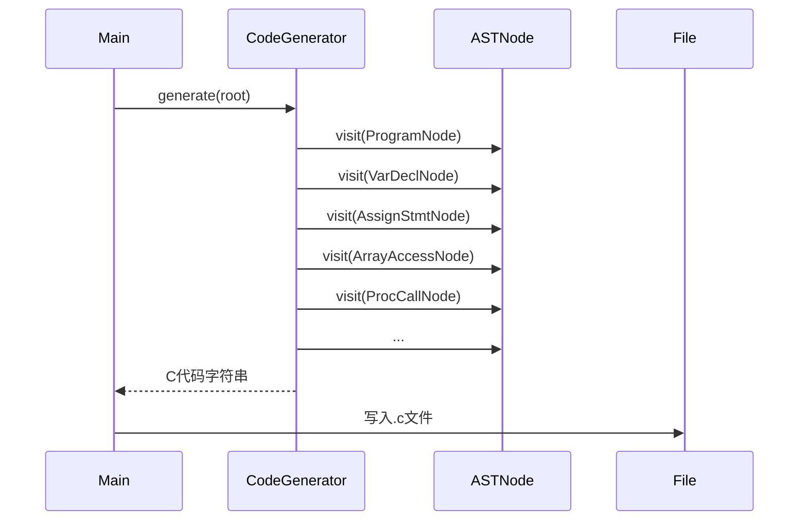

# Pascal-S 到 C 代码生成模块设计文档

**版本号**：V1.0  
**日期**：2026-03-19

---

## 1. 模块定位与目标

代码生成模块(Code Generator)是编译器后端的核心，负责将经过语义分析和注解的抽象语法树(AST)转换为等价的 C 语言源代码。该模块需严格遵循前端各阶段传递的数据结构和接口规范，确保生成的 C 代码可直接通过 GCC 等主流编译器编译运行，并在语义上与原 Pascal-S 程序一致。

---

## 2. 输入输出与接口约定

### 2.1 输入

- **AST 根节点**：类型为 `ProgramNode*`，已由前端完成语法建树和语义注解。
- **符号表**：通过 AST 节点的 `symbolEntry` 字段间接访问，包含所有作用域、类型、参数、数组信息。
- **错误处理接口**：`ErrorHandler`，用于报告代码生成阶段的错误。

### 2.2 输出

- **C 语言源代码字符串**：可写入 `.c` 文件。
- **接口函数**：
  ```cpp
  class CodeGenerator {
  public:
      std::string generate(ProgramNode* root);
      // Visitor接口
      void visit(AssignStmtNode*);
      void visit(ArrayAccessNode*);
      void visit(ProcCallNode*);
      // ... 其他AST节点类型
  };
  ```

---

## 3. 文件组织与实现分工

### 3.1 主要文件

- `include/code_generator.h`  
  代码生成器类声明，Visitor接口定义。

- `src/code_generator.cpp`  
  代码生成器实现，AST各节点的visit方法，C代码拼接逻辑。

- `include/codegen_utils.h` / `src/codegen_utils.cpp`  
  代码生成辅助工具，如类型映射、临时变量/标签生成、格式化输出等。

- 相关依赖：  
  - `ast.h`/`ast.cpp`：AST节点定义与工厂
  - `symbol_table.h`/`symbol_table.cpp`：符号表
  - `error_handler.h`/`error_handler.cpp`：错误处理

### 3.2 代码生成流程

1. **入口**：`CodeGenerator::generate(ProgramNode* root)`，递归遍历AST。
2. **节点分派**：采用Visitor模式，每种AST节点类型实现对应的`visit`方法。
3. **C代码拼接**：每个visit方法负责将对应Pascal-S结构翻译为C语法，处理类型、数组、参数、语句等。
4. **辅助工具**：类型映射、下标偏移、var参数处理、临时变量/标签生成等通过工具类/函数实现。
5. **输出**：最终C代码字符串返回，由主程序写入目标文件。

### 3.3 文件架构建议

建议的代码生成相关文件与目录结构如下：

```
/include/
    code_generator.h        // 代码生成器类声明，Visitor接口定义
    codegen_utils.h         // 代码生成辅助工具声明
    ast.h                   // AST节点声明（依赖）
    symbol_table.h          // 符号表声明（依赖）
    error_handler.h         // 错误处理声明（依赖）

/src/
    code_generator.cpp      // 代码生成器实现，AST各节点visit方法
    codegen_utils.cpp       // 代码生成辅助工具实现
    ast.cpp                 // AST节点实现（依赖）
    symbol_table.cpp        // 符号表实现（依赖）
    error_handler.cpp       // 错误处理实现（依赖）

/test/
    codegen_cases/          // 代码生成测试用例（Pascal-S源文件及期望C代码）

/docs/
    Xiekang-docs/代码生成设计.md   // 本设计文档
```

**各文件说明：**
- `code_generator.h/cpp`：主代码生成器类，负责AST遍历与C代码拼接。
- `codegen_utils.h/cpp`：类型映射、下标偏移、临时变量生成等辅助函数。
- `ast.h/cpp`、`symbol_table.h/cpp`、`error_handler.h/cpp`：由前端实现，代码生成阶段只需调用接口。
- `/test/codegen_cases/`：建议为代码生成阶段单独准备测试用例，便于回归测试。

---

## 4. 关键实现点与注意事项

### 4.1 Pascal-S 到 C 的映射规则

- **类型映射**：`integer`→`int`，`real`→`double`，`boolean`→`int`，`char`→`char`
- **常量/变量声明**：常量用`const`或`#define`，变量直接声明
- **数组**：声明时分配`upper-lower+1`空间，访问时`A[i]`→`A[i-lower]`
- **过程/函数**：过程为`void`函数，函数返回类型映射，参数区分传值/引用（`int *x`）
- **var参数**：声明为指针，调用时加`&`，函数体内用`*x`
- **赋值**：`:=`→`=`
- **复合语句**：`begin...end`→`{...}`
- **条件/循环**：`if-then-else`、`for-to-do`等直接映射
- **输入输出**：`read(x)`→`scanf`，`write(x)`→`printf`，根据类型选择格式符
- **函数返回值**：Pascal用`func_name := value`，C中需引入`_retval`变量，最后`return _retval`

### 4.2 重点与难点

- **数组下标偏移**：所有数组访问需自动减去下界
- **var参数处理**：声明、调用、使用均需区分指针/取地址/解引用
- **作用域与命名冲突**：变量名、函数名统一小写，避免C命名冲突
- **临时变量/标签管理**：如需生成中间变量或标签，需保证唯一性
- **错误处理**：如遇无法映射的类型、非法结构，调用`ErrorHandler`报告

### 4.3 代码生成具体要求

#### 4.3.1 Visitor 基础遍历与代码生成框架

- 采用 Visitor 模式递归遍历 AST，每个节点类型实现对应的 `visit` 方法。
- `CodeGenerator::generate(ProgramNode* root)` 为入口，负责初始化输出缓冲区、头文件、主函数等。
- 每个 `visit` 方法负责拼接对应节点的 C 代码片段，必要时递归访问子节点。
- 推荐将表达式与语句分开处理，表达式节点返回字符串，语句节点直接拼接到输出缓冲。

#### 4.3.2 基础语句与表达式生成

- **变量声明**：根据类型映射直接生成 C 变量声明。
- **常量声明**：生成 `const` 或 `#define`。
- **赋值语句**：`a := b + 1;` → `a = b + 1;`
- **复合语句**：`begin ... end` → `{ ... }`
- **条件语句**：`if ... then ... else ...` → `if (...) { ... } else { ... }`
- **循环语句**：`for i := 1 to 10 do ...` → `for (i = 1; i <= 10; ++i) { ... }`
- **输入输出**：`read(x)` → `scanf`，`write(x)` → `printf`，根据类型选择格式符。

#### 4.3.3 数组访问与下标偏移

- Pascal-S 数组下标可非0起始，C 必须从0起始。
- 声明时分配 `upper-lower+1` 空间，访问时 `A[i]` → `A[i-lower]`。
- 多维数组需对每一维做偏移处理。
- 建议实现辅助函数自动生成下标偏移表达式。

#### 4.3.4 过程/函数调用与参数传递

- **过程声明**：`procedure p(x: integer; var y: integer)` → `void p(int x, int *y)`
- **函数声明**：`function f(x: integer): integer` → `int f(int x)`
- **调用**：传值参数直接传递，`var` 参数调用时加 `&`，如 `p(a, b)` → `p(a, &b)`
- **函数返回值**：Pascal-S 用 `func_name := value`，C 需引入 `_retval` 局部变量，最后 `return _retval;`
- **过程/函数体内**：`var` 参数使用时需加 `*` 解引用。

#### 4.3.5 复杂节点与特殊处理

- **嵌套复合语句**：递归生成 `{ ... }`，保证作用域正确。
- **表达式节点**：递归生成子表达式，正确处理运算符优先级和括号。
- **数组参数**：支持数组作为参数时，传递指针并正确处理下标偏移。
- **作用域与命名冲突**：所有生成的变量、函数名统一小写，避免与 C 关键字冲突。
- **临时变量与标签**：如需生成临时变量或标签（如 for/while），需保证命名唯一性，可用自增编号。

#### 4.3.6 单元测试建议

- 每类语法结构（声明、赋值、数组、过程、函数、递归、输入输出等）均需准备独立的 Pascal-S 测试用例，生成 C 代码后与预期输出比对。
- 重点测试：
  - 数组下标偏移正确性（不同下界、多维数组）
  - 过程/函数的 var 参数传递与解引用
  - 递归调用、嵌套复合语句
  - 输入输出格式符选择
  - 错误用例（如非法下标、未声明变量）能否正确报错
- 建议在 `/test/codegen_cases/` 目录下维护用例，自动化测试生成的 C 代码能否通过 gcc 编译并运行结果正确。

---

## 5. 代码生成模块与其他模块的协作

- **与AST模块**：通过Visitor接口遍历AST，读取节点类型、子节点、符号表信息
- **与符号表模块**：通过AST节点的`symbolEntry`获取类型、参数、数组上下界等信息
- **与错误处理模块**：遇到不支持或非法结构时，调用统一错误报告接口
- **与主控流程**：主程序负责调用`CodeGenerator::generate()`，并将结果写入文件

---

## 6. 典型流程示意



---

## 7. 代码生成模块开发建议

- **严格遵循接口**：所有AST节点、符号表信息均通过既定接口访问
- **分阶段调试**：建议先实现声明、赋值、表达式等基础结构，再逐步支持数组、过程/函数、输入输出等复杂结构
- **充分测试**：用官方gcd、quicksort等用例验证生成C代码的正确性
- **注重可维护性**：代码风格统一，注释清晰，便于后续扩展和维护

---

**文档结束**
