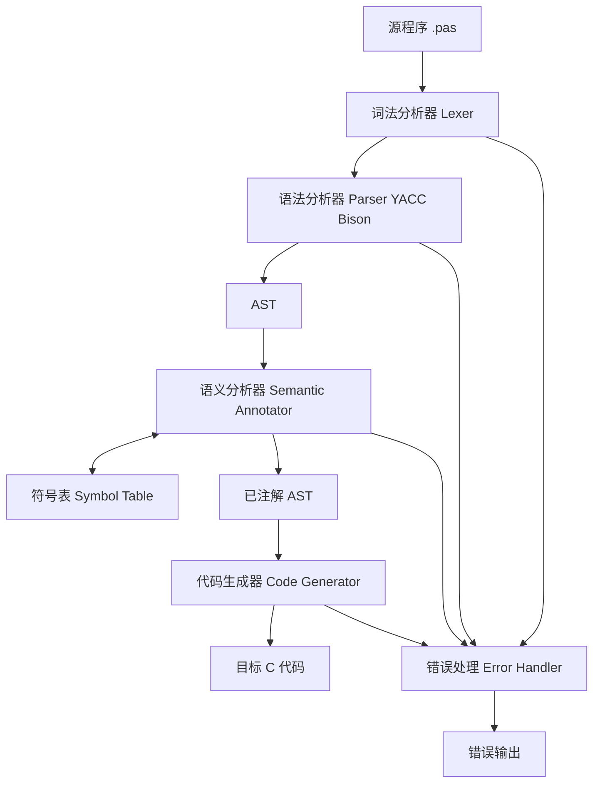
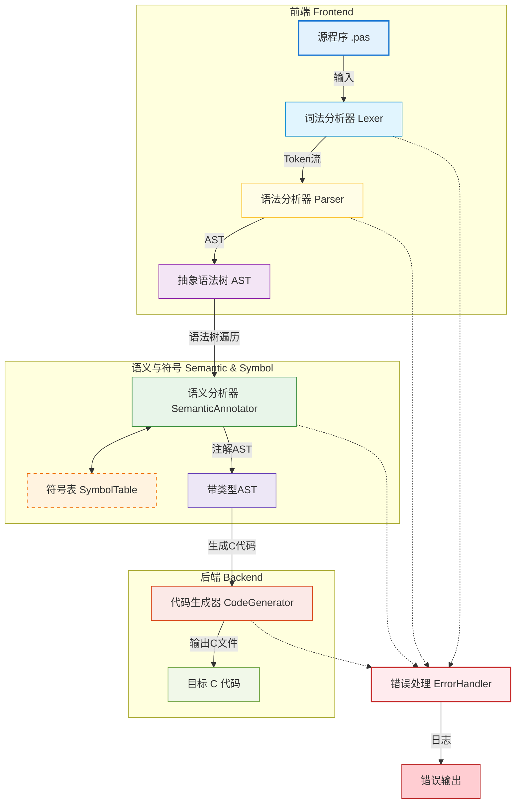
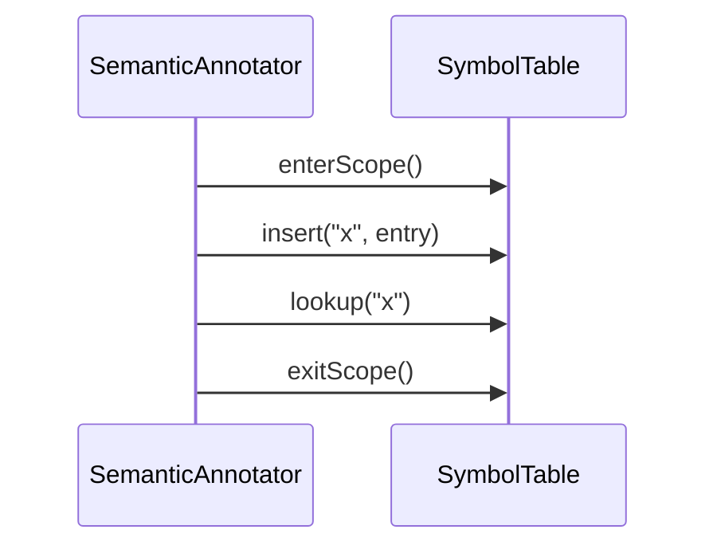

# 《Pascal-S 到 C 语言编译器》总体设计文档

**版本号**：V2.1  
**日期**：2026-03-19  
**依据文件**：《编译原理与技术课程设计》任务书（202601版）、需求分析说明书

---

## 1. 引言

### 1.1 编写目的
本文档旨在明确“Pascal-S 到 C 语言编译器”的总体架构、模块划分、接口设计及核心数据结构。它是后续详细设计、编码实现及测试验收的指导性文件，确保开发团队对系统构建有一致的理解，并严格响应课程任务书的各项约束。

### 1.2 项目背景
本项目是《编译原理与技术》课程的核心实践环节。目标是构建一个完整的编译系统，将简化版的 Pascal 语言（Pascal-S）源代码转换为等效的 C 语言源代码。系统需涵盖词法分析、语法分析、语义分析及代码生成全过程，并采用“**语法归约建树 + 语义注解 + Visitor 生成**”的分层实现路线。

### 1.3 设计原则
*   **模块化**：各编译阶段逻辑解耦，通过标准接口交互。
*   **语法制导**：采用 S-属性文法，在语法归约时驱动建树与必要语义入口，不在 Parser 阶段直接生成目标代码。
*   **约束遵循**：严格遵循任务书关于“标识符不区分大小写”、“过程不可嵌套”等特定约束。
*   **健壮性**：具备完善的错误恢复机制，单次编译尽可能多地报告错误。

---


## 2. 软件总体设计

### 2.1 软件功能（功能模块划分）
本编译器系统分为如下主要功能模块：
1. 词法分析器（Lexer）：将 Pascal-S 源代码转为 Token 流，处理注释、大小写、错误等。
2. 语法分析器（Parser）：基于 LALR(1) 技术（YACC/Bison），将 Token 流转为抽象语法树（AST），并进行初步语法错误检测。
3. 语义分析器（Semantic Annotator）：遍历 AST，进行类型检查、作用域检查、符号表管理、参数检查、数组下标检查等。
4. 符号表（Symbol Table）：支持多层作用域的符号管理，存储变量、常量、过程/函数、数组等信息。
5. 代码生成器（Code Generator）：基于 Visitor 模式遍历已注解 AST，生成等价 C 代码，处理类型映射、数组下标偏移、var 参数等。
6. 错误处理模块（Error Handler）：统一报告词法、语法、语义、代码生成等各类错误，支持错误恢复与聚合。
7. 测试与驱动模块：负责编译流程控制、文件输入输出、测试用例管理。

### 2.2 软件结构（功能模块之间的关系）
各模块之间的数据流和调用关系如下：

1. 源文件输入后，首先由词法分析器（Lexer）处理，输出 Token 流。
2. 语法分析器（Parser）基于 LR 分析技术（YACC/Bison），递归调用语法规则，将 Token 流归约为 AST。
3. 语义分析器（Semantic Annotator）对 AST 进行深度优先递归遍历，调用符号表接口进行符号管理和类型检查。
4. 错误处理模块在各阶段被调用，报告并聚合错误。
5. 代码生成器（Code Generator）以 Visitor 方式递归遍历已注解 AST，生成 C 代码。
6. 测试与驱动模块负责整体流程调度和文件管理。

> 递归调用函数：AST 遍历、语义分析、代码生成均采用递归方式实现。
> LR 分析技术：语法分析阶段采用 LALR(1) 分析，使用 YACC/Bison 工具自动生成分析器。

下图展示了各模块之间的主要关系：



---
## 3. 系统总体架构

### 2.1 逻辑架构
系统采用经典的**前端驱动型**架构，数据流呈线性管道状，新增 AST 作为语法分析与代码生成之间的中间表示，辅以全局数据存储（符号表）。



### 2.2 物理结构
项目将采用以下文件组织结构：
*   `include/`
    *   `ast.h` : AST 节点层级定义与节点工厂接口
    *   `semantic_annotator.h` : AST 语义注解接口
    *   `code_generator.h` : 基于 Visitor 的目标代码生成接口
    *   `symbol_table.h` : 符号表类定义
    *   `error_handler.h` : 错误处理接口
    *   `codegen_utils.h` : 辅助代码生成工具接口
*   `src/`
    *   `lexer.l` : Flex 词法定义文件（含注释处理、大小写转换）
    *   `parser.y` : Bison 语法定义及建树动作文件
    *   `ast.cpp` : AST 节点与构建器实现
    *   `semantic_annotator.cpp` : AST 语义注解实现
    *   `code_generator.cpp` : 基于 Visitor 的目标代码生成实现
    *   `symbol_table.cpp` : 符号表实现
    *   `error_handler.cpp` : 错误处理实现
    *   `codegen_utils.cpp` : 辅助代码生成实现
    *   `main.cpp` : 程序入口
*   `test/` : 测试用例（含快速排序 Quicksort.pas）
*   `docs/` : 设计文档及 AI 辅助记录
*   `Makefile` : 构建脚本

---

## 3. 模块详细设计

### 3.1 词法分析模块 (Lexer)
*   **工具**：Flex (Lex)
*   **输入**：Pascal-S 源程序字符流。
*   **输出**：Token 序列（`token_type`, `attribute_value`, `line_no`, `col_no`）。
*   **核心功能**：
    *   **关键字识别**：识别 `if`, `then`, `else`, `while`, `procedure`, `function`, `const`, `array` 等。
    *   **标识符处理**：识别标识符后，**强制转换为小写**存储，以满足“不区分大小写”的要求。
    *   **常数识别**：支持整数、实数、字符常量（`'a'`）及带符号常数（`+10`, `-5`）。
    *   **注释处理**：识别 `{ ... }` 形式的注释，跳过其内容但正确统计换行数以保持行号准确。
    *   **异常处理**：识别非法字符，调用 `ErrorHandler::lexicalError()`。
*   **接口**：`int yylex()`，由 Bison 自动调用。

### 3.2 语法分析与建树模块 (Parser & AST Builder)
*   **工具**：Bison (Yacc)
*   **输入**：Token 序列（已归一化的标识符）。
*   **输出**：`ProgramNode* root`（AST 根节点）。
*   **核心机制**：
    *   **文法定义**：严格基于任务书提供的 Pascal-S BNF 范式。
    *   **属性定义**：为每个非终结符定义 AST 节点属性（如 `ASTNode* node`、`ExprNode* expr`），不在此阶段拼接目标代码。
    *   **语义动作**：
        *   *声明处理*：在 `ConstDecl`, `VarDecl`, `ProcDecl` 归约时，解析具体类型（含数组上下界），调用符号表插入。
        *   *建树处理*：在语句归约时，创建 AST 子类节点并连接父子关系。
        *   *示例*：
          ```yacc
          Stmt: IF Expr THEN Stmt1
                {
                    $$ = ast_builder.makeIfStmt($2, $4, nullptr);
                }
          ;
          ```
    *   **约束执行**：在遇到过程内部再定义过程时，记录语义检查点并在注解阶段统一报错（响应“过程不可嵌套”约束）。
    *   **冲突治理**：通过“可选语句层 + 非空语句层”拆分可空规则，避免同一语境下多规则同时可空引发 RR 冲突；该治理仅调整文法结构，不改变 AST 语义动作。

### 3.3 AST 模块 (Abstract Syntax Tree)
*   **定位**：AST 是 Parser 与后续阶段的中间契约，解除“语法分析直接拼接 C 代码”的耦合。
*   **核心结构**：
    *   `ASTNode` 基类：`NodeType nodeType`, `DataType dataType`, `SourcePos pos`, `vector<ASTNode*> children`。
    *   语句节点：`AssignStmtNode`, `IfStmtNode`, `ForStmtNode`, `CompoundStmtNode`, `ProcCallNode`。
    *   表达式节点：`BinaryExprNode`, `UnaryExprNode`, `LiteralNode`, `IdentifierNode`, `ArrayAccessNode`。
    *   声明节点：`VarDeclNode`, `ConstDeclNode`, `ProcDeclNode`, `FuncDeclNode`。
*   **注解槽位（由语义阶段填充）**：
    *   `const SymbolEntry* symbolEntry`
    *   `bool isLValue`
    *   `ArrayBoundInfo arrayBounds`
    *   `ParamPassingInfo paramInfo`
*   **接口约束**：
    *   `ASTNode* buildTree(NodeType type, std::vector<ASTNode*> children)`
    *   `ProgramNode* getParseResultRoot()`
    *   所有节点持有准确的行列号，错误模块统一引用 `node->pos` 定位。


### 3.4 符号表模块 (Symbol Table)
#### 3.4.1 内容与条目结构
- 支持存储变量、常量、数组、过程、函数等所有 Pascal-S 可声明实体。
- 每个条目（SymbolEntry）包含：
  - 名称（统一小写）
  - 类型（DataType）
  - 种类（变量/常量/过程/函数/数组）
  - 作用域层级（scopeLevel）
  - 常量值（constValue）、数组上下界（lower/upper）、参数列表（含 var/value 区分）、返回值类型等多态属性

#### 3.4.2 逻辑结构与作用域管理
- 采用“哈希表 + 栈”结构，每进入一个新作用域（如过程/函数体）即压入新表，退出时弹出。
- 作用域链最大深度为2（全局+局部），禁止过程/函数嵌套定义。
- 查找时先查当前作用域，未找到再查外层。
- 插入时仅在当前作用域查重。

#### 3.4.3 操作流程
1. 初始化时创建全局作用域。
2. 进入过程/函数时调用 enterScope()，新建局部表。
3. 声明时 insert(name, entry)，若重名则报错。
4. 使用标识符时 lookup(name)，未找到则报错。
5. 退出过程/函数时 exitScope()，释放局部表。

#### 3.4.4 关键接口
```cpp
class SymbolTable {
public:
    void enterScope(); // 进入新作用域
    void exitScope();  // 退出当前作用域
    bool insert(const std::string& name, SymbolEntry* entry); // 插入符号
    SymbolEntry* lookup(const std::string& name); // 查找符号
    int getCurrentScopeLevel(); // 获取当前作用域层级
};
```

#### 3.4.5 典型流程示意


---


### 3.5 语义分析与错误处理模块
#### 3.5.1 错误类型
- 词法错误：非法字符、未闭合注释、标识符超长等
- 语法错误：缺失分号、括号不匹配、结构错误等
- 语义错误：未声明、重复定义、类型不兼容、参数错误、数组越界、过程嵌套等
- 代码生成错误：类型映射失败、下标偏移错误等

#### 3.5.2 错误处理与恢复策略
- 统一错误报告接口：`reportError(line, col, message)`，所有阶段调用
- 恐慌模式（panic mode）：
    - 语法分析遇错时，跳过至下一个同步符号（如分号、end、}），继续分析后续代码
- 错误聚合：
    - 记录所有错误，累计计数，超过阈值（如10）可中止编译
- 语义分析阶段：
    - 检查到错误时，调用 ErrorHandler 记录并输出，但不立即终止，继续遍历 AST
- 错误输出格式：
    - `Error [Line:Col]: Description`

#### 3.5.3 关键接口
```cpp
class ErrorHandler {
public:
        void reportError(int line, int col, const std::string& message);
        void lexicalError(...);
        void syntaxError(...);
        void semanticError(...);
        int getErrorCount();
};
```

---

### 3.6 代码生成模块 (Code Generator)
*   **策略**：基于 AST 的 Visitor 生成，不依赖 Bison 归约上下文。
*   **映射规则**：
    *   Pascal `array[1..10] of integer` -> C `int arr[10];` (需注意下标偏移处理，C 从 0 开始，Pascal 可能从 1 或其他数开始，需生成宏或调整访问逻辑)。
    *   Pascal `var x: integer` (作为参数) -> C `int *x` (指针传递)。
    *   Pascal `function` -> C 函数，返回值类型映射。
*   **辅助功能**：临时变量管理、标号生成、类型转换插入。
*   **核心接口**：
    *   `std::string CodeGenerator::generate(ProgramNode* root)`
    *   `void CodeGenerator::visit(AssignStmtNode*)`
    *   `void CodeGenerator::visit(ArrayAccessNode*)`
    *   `void CodeGenerator::visit(ProcCallNode*)`

---

## 4. 数据结构设计

### 4.1 Token 结构体
```cpp
struct Token {
    int type;       // 枚举类型
    string value;   // 属性值 (标识符已转小写)
    int line;       
    int col;        
};
```

### 4.2 AST 节点结构体（核心契约）
```cpp
enum class NodeType {
    PROGRAM, BLOCK, VAR_DECL, CONST_DECL, PROC_DECL, FUNC_DECL,
    ASSIGN_STMT, IF_STMT, FOR_STMT, COMPOUND_STMT, PROC_CALL,
    BINARY_EXPR, UNARY_EXPR, IDENTIFIER, LITERAL, ARRAY_ACCESS
};

struct SourcePos {
    int line;
    int col;
};

struct ASTNode {
    NodeType nodeType;
    DataType dataType;                  // 语义阶段填充
    SourcePos pos;
    std::vector<ASTNode*> children;
    SymbolEntry* symbolEntry = nullptr; // 语义阶段绑定
    virtual ~ASTNode() = default;
};
```

### 4.3 符号表条目 (SymbolEntry) - **增强版**
```cpp
enum DataType { TYPE_INTEGER, TYPE_REAL, TYPE_BOOLEAN, TYPE_CHAR, TYPE_PROCEDURE, TYPE_FUNCTION };
enum ParamKind { PARAM_BY_VALUE, PARAM_BY_REFERENCE }; // 对应 var 参数

// 数组信息结构
struct ArrayInfo {
    int lower_bound;
    int upper_bound;
    DataType element_type;
};

// 过程/函数信息结构
struct ProcInfo {
    vector<DataType> param_types;
    vector<ParamKind> param_kinds; // 区分传值/传址
    DataType return_type;          // 函数返回值类型，过程可为 TYPE_VOID
};

// 常量值联合体
union ConstValue {
    int i_val;
    float r_val;
    char c_val;
};

struct SymbolEntry {
    string name;            // 统一小写
    DataType type;
    int scopeLevel;         // 0: Global, 1: Local
    
    // 标志位
    bool isConstant;
    bool isArray;
    bool isProcedure;

    // 多态属性
    union {
        ConstValue const_val;   // 如果是常量
        ArrayInfo arr_info;     // 如果是数组
        ProcInfo proc_info;     // 如果是过程/函数
    } attributes;

    int offset;             // 局部变量栈帧偏移量
};
```

### 4.4 作用域节点 (ScopeNode)
```cpp
class ScopeNode {
    map<string, SymbolEntry*> symbols; // Key 为小写名称
    ScopeNode* parentScope;
    int level;
public:
    ScopeNode(ScopeNode* parent, int lvl);
    void insert(string name, SymbolEntry* entry);
    SymbolEntry* lookup(string name);
    // ...
};
```

---


## 5. 接口详细定义

### 5.1 外部接口
- **命令行接口**：
    - `compiler input.pas -o output.c`
    - 参数说明：
        - `input.pas`：待编译的 Pascal-S 源文件
        - `-o output.c`：指定输出 C 代码文件名
- **文件接口**：
    - 输入：`.pas` 源文件
    - 输出：`.c` 目标代码文件
    - 错误输出：`stderr`，或生成错误日志文件

### 5.2 内部接口

#### 5.2.1 词法分析器与语法分析器
- `int yylex()`
    - 功能：返回下一个 Token，供 Bison 调用
    - 传递结构：
        ```cpp
        typedef struct {
                TokenType type;
                char* value;      // 标识符/常数具体值
                int line;         // 行号
                int col;          // 列号
        } Token;
        extern Token yylval;
        ```
    - 说明：标识符已转小写，Token 包含位置信息

#### 5.2.2 语法分析器与AST建树
- `ASTNode* buildTree(NodeType type, std::vector<ASTNode*> children)`
    - 功能：归约时构建对应类型的 AST 节点
- `ProgramNode* getParseResultRoot()`
    - 功能：获取完整 AST 根节点

#### 5.2.3 语义分析器与符号表
- `class SemanticAnnotator`：
    - `void annotate(ASTNode* root);` // 递归遍历 AST，进行类型检查、符号绑定
    - `void checkAssignment(ASTNode* assignNode);` // 检查赋值兼容性
    - `void checkCall(ASTNode* callNode);` // 检查过程/函数调用参数
    - `void checkArrayAccess(ASTNode* arrNode);` // 检查数组下标类型与范围
- `class SymbolTable`：
    - `void enterScope();` // 进入新作用域
    - `void exitScope();` // 退出当前作用域
    - `bool insert(const std::string& name, SymbolEntry* entry);` // 插入符号，返回是否成功
    - `SymbolEntry* lookup(const std::string& name);` // 查找符号，支持多层作用域
    - `int getCurrentScopeLevel();` // 获取当前作用域层级

#### 5.2.4 语义分析器与错误处理
- `class ErrorHandler`：
    - `void reportError(int line, int col, const std::string& message);` // 统一错误报告
    - `void lexicalError(...);` // 词法错误
    - `void syntaxError(...);` // 语法错误
    - `void semanticError(...);` // 语义错误
    - `int getErrorCount();` // 获取累计错误数

#### 5.2.5 代码生成器与AST
- `class CodeGenerator`：
    - `std::string generate(ProgramNode* root);` // 生成 C 代码
    - `void visit(AssignStmtNode* node);`
    - `void visit(ArrayAccessNode* node);`
    - `void visit(ProcCallNode* node);`
    - ... // 其他 AST 节点类型

#### 5.2.6 文件与模块接口
- 源文件与各阶段模块通过内存数据结构（Token、AST、符号表等）传递信息，文件接口仅用于输入输出。

---

## 6. 运行流程设计

1.  **初始化**：创建全局符号表（Level 0），初始化错误计数器。
2.  **驱动解析**：
    *   调用 `yyparse()`。
    *   Flex 读取字符，**过滤 `{}` 注释**，识别 Token，**标识符转小写**。
    *   Bison 移进/归约，触发建树动作并得到 `ProgramNode* root`。
    *   调用 `SemanticAnnotator::annotate(root)` 执行语义检查与节点注解。
    *   调用 `CodeGenerator::generate(root)` 生成 C 代码，处理数组下标偏移和 var 参数映射。
3.  **收尾处理**：
    *   若无致命错误，写入 `.c` 文件。
    *   输出编译统计。
4.  **资源释放**。

---

## 7. 关键技术与难点应对

| 关键技术点 | 潜在难点 | 解决方案 |
| :--- | :--- | :--- |
| **标识符大小写** | Pascal 不区分，C 区分 | **词法阶段统一转小写**，符号表 Key 全为小写，生成的 C 代码变量名也全为小写。 |
| **数组下标映射** | Pascal 下标任意 (如 3..9)，C 从 0 开始 | 方案 A：生成 C 代码时分配足够空间，访问时通过宏 `#define ARR(i) (arr[(i)-3])` 进行偏移修正。方案 B：在 Visitor 访问数组节点时直接计算偏移 `arr[i-3]`。 |
| **Var 参数传递** | Pascal `var` 是引用传递，C 是值传递 | 符号表记录 `PARAM_BY_REFERENCE`。生成函数声明时将参数转为指针 `int *x`，调用时取地址 `&x`，函数体内解引用 `*x`。 |
| **过程嵌套限制** | 需防止用户定义嵌套过程 | 在 Parser 建树阶段记录作用域层级，在语义注解阶段统一检测并报语义错误。 |
| **常量与字符** | 支持 `'a'` 及 `+10` 等形式 | 词法分析识别字符常量转为 ASCII 整型；识别带符号数字，在常量声明段直接计算值存入符号表。 |

---

## 8. 测试策略概要

*   **单元测试**：
    *   符号表：测试大小写不敏感查找 (`Var` vs `var`)。
    *   数组：测试不同下界定义的数组访问代码生成。
    *   参数：测试 `var` 参数的指针转换逻辑。
*   **集成测试**：
    *   **核心用例**：**快速排序 (Quicksort)** 程序。
        *   覆盖点：递归过程调用、数组传递（引用）、复杂条件判断、整数运算。
        *   验证：生成的 C 代码需能通过 `gcc` 编译，且对随机输入数据排序结果正确。
    *   **边界用例**：
        *   包含 `{ 注释 }` 的程序。
        *   包含 `const` 定义的程序。
        *   尝试嵌套定义过程（应报错）。
        *   大小写混合使用的程序（应正常编译）。
*   **AI 辅助记录**：
    *   保留关键提示词（Prompt）截图，证明设计过程中对 SDT 逻辑、Bison 冲突解决等关键环节的 AI 辅助思考过程（符合任务书第 38 页要求）。

---

**日期**：2026-03-19