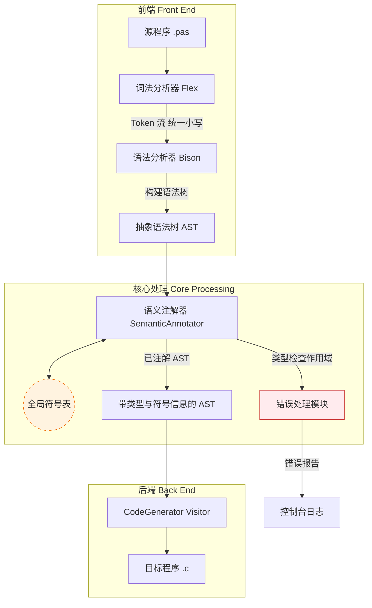

# 《Pascal-S 到 C 语言编译器》总体设计文档

**版本号**：V2.1  
**日期**：2026-03-19  
**依据文件**：《编译原理与技术课程设计》任务书（202601版）、需求分析说明书

---

## 1. 引言

### 1.1 编写目的
本文档旨在明确“Pascal-S 到 C 语言编译器”的总体架构、模块划分、接口设计及核心数据结构。它是后续详细设计、编码实现及测试验收的指导性文件，确保开发团队对系统构建有一致的理解，并严格响应课程任务书的各项约束。

### 1.2 项目背景
本项目是《编译原理与技术》课程的核心实践环节。目标是构建一个完整的编译系统，将简化版的 Pascal 语言（Pascal-S）源代码转换为等效的 C 语言源代码。系统需涵盖词法分析、语法分析、语义分析及代码生成全过程，并重点实践**语法制导翻译（SDT）**技术。

### 1.3 设计原则
*   **模块化**：各编译阶段逻辑解耦，通过标准接口交互。
*   **语法制导**：严格采用 S-属性文法，利用 Bison/Yacc 工具在语法归约时驱动语义动作。
*   **约束遵循**：严格遵循任务书关于“标识符不区分大小写”、“过程不可嵌套”等特定约束。
*   **健壮性**：具备完善的错误恢复机制，单次编译尽可能多地报告错误。

---

## 2. 系统总体架构

### 2.1 逻辑架构
系统采用经典的**前端驱动型**架构，数据流呈线性管道状，新增 AST 作为语法分析与代码生成之间的中间表示，辅以全局数据存储（符号表）。



### 2.2 物理结构
项目将采用以下文件组织结构：
*   `src/`
    *   `lexer.l` : Flex 词法定义文件（含注释处理、大小写转换）
    *   `parser.y` : Bison 语法定义及建树动作文件
    *   `ast.h/cpp` : AST 节点层级定义与节点工厂
    *   `semantic_annotator.h/cpp` : AST 语义注解（类型/符号绑定）
    *   `code_generator.h/cpp` : 基于 Visitor 的目标代码生成
    *   `symbol_table.h/cpp` : 符号表类定义与实现（支持数组/常量/过程）
    *   `error_handler.h/cpp` : 错误处理类定义与实现
    *   `codegen_utils.h/cpp` : 辅助代码生成工具
    *   `main.cpp` : 程序入口
*   `test/` : 测试用例（含快速排序 Quicksort.pas）
*   `docs/` : 设计文档及 AI 辅助记录
*   `Makefile` : 构建脚本

---

## 3. 模块详细设计

### 3.1 词法分析模块 (Lexer)
*   **工具**：Flex (Lex)
*   **输入**：Pascal-S 源程序字符流。
*   **输出**：Token 序列（`token_type`, `attribute_value`, `line_no`, `col_no`）。
*   **核心功能**：
    *   **关键字识别**：识别 `if`, `then`, `else`, `while`, `procedure`, `function`, `const`, `array` 等。
    *   **标识符处理**：识别标识符后，**强制转换为小写**存储，以满足“不区分大小写”的要求。
    *   **常数识别**：支持整数、实数、字符常量（`'a'`）及带符号常数（`+10`, `-5`）。
    *   **注释处理**：识别 `{ ... }` 形式的注释，跳过其内容但正确统计换行数以保持行号准确。
    *   **异常处理**：识别非法字符，调用 `ErrorHandler::lexicalError()`。
*   **接口**：`int yylex()`，由 Bison 自动调用。

### 3.2 语法分析与语法制导翻译模块 (Parser & SDT)
*   **工具**：Bison (Yacc)
*   **输入**：Token 序列（已归一化的标识符）。
*   **输出**：`ProgramNode* root`（AST 根节点）。
*   **核心机制**：
    *   **文法定义**：严格基于任务书提供的 Pascal-S BNF 范式。
    *   **属性定义**：为每个非终结符定义 AST 节点属性（如 `ASTNode* node`、`ExprNode* expr`），不在此阶段拼接目标代码。
    *   **语义动作**：
        *   *声明处理*：在 `ConstDecl`, `VarDecl`, `ProcDecl` 归约时，解析具体类型（含数组上下界），调用符号表插入。
        *   *建树处理*：在语句归约时，创建 AST 子类节点并连接父子关系。
        *   *示例*：
          ```yacc
          Stmt: IF Expr THEN Stmt1
                {
                    $$ = ast_builder.makeIfStmt($2, $4, nullptr);
                }
          ;
          ```
    *   **约束执行**：在遇到过程内部再定义过程时，触发语义报错（响应“过程不可嵌套”约束）。

### 3.3 AST 模块 (Abstract Syntax Tree)
*   **定位**：AST 是 Parser 与后续阶段的中间契约，解除“语法分析直接拼接 C 代码”的耦合。
*   **核心结构**：
    *   `ASTNode` 基类：`NodeType nodeType`, `DataType dataType`, `SourcePos pos`, `vector<ASTNode*> children`。
    *   语句节点：`AssignStmtNode`, `IfStmtNode`, `ForStmtNode`, `CompoundStmtNode`, `ProcCallNode`。
    *   表达式节点：`BinaryExprNode`, `UnaryExprNode`, `LiteralNode`, `IdentifierNode`, `ArrayAccessNode`。
    *   声明节点：`VarDeclNode`, `ConstDeclNode`, `ProcDeclNode`, `FuncDeclNode`。
*   **注解槽位（由语义阶段填充）**：
    *   `SymbolEntry* symbolEntry`
    *   `bool isLValue`
    *   `ArrayBoundInfo arrayBounds`
    *   `ParamPassingInfo paramInfo`
*   **接口约束**：
    *   `ASTNode* buildTree(NodeType type, std::vector<ASTNode*> children)`
    *   `ProgramNode* getParseResultRoot()`
    *   所有节点持有准确的行列号，错误模块统一引用 `node->pos` 定位。

### 3.4 符号表模块 (Symbol Table)
*   **数据结构**：采用**散列表 (Hash Table)** 嵌套 **栈 (Stack)** 结构。
    *   **作用域限制**：根据任务书“过程和函数定义不允许嵌套”的要求，作用域链最大深度为 2（全局层 Level 0 + 过程/函数层 Level 1）。
    *   **Entry 设计**：支持多态属性，区分变量、常量、数组、过程/函数。
*   **核心功能**：
    *   `enterScope()`: 进入过程体，压入新作用域（Level 1）。
    *   `exitScope()`: 退出过程体，弹出局部符号。
    *   `insert(name, entry)`: 插入符号，若重复则报错。**注意：Name 已预转为小写**。
    *   `lookup(name)`: 查找符号，先查当前作用域，再查全局。
    *   **特殊支持**：
        *   **常量**：存储常量的具体值（Int/Real/Char），用于后续可能的常量折叠或检查。
        *   **数组**：存储 `lower_bound`, `upper_bound`, `element_type`。
        *   **过程/函数**：存储参数列表（区分 `var` 传址和值传参）及返回值类型。

### 3.5 语义分析与错误处理模块
*   **输入/输出**：输入 AST 根节点，输出“已注解 AST”（节点附带类型和符号表引用）。
*   **执行方式**：采用 `SemanticAnnotator::annotate(ASTNode* root)` 深度优先遍历。
*   **类型检查**：
    *   严格检查赋值兼容性（如 Integer 不能直接赋给 Boolean）。
    *   检查数组下标是否在定义的 `lower_bound` 和 `upper_bound` 范围内（静态检查或生成运行时检查代码）。
    *   检查过程调用的参数个数、类型及传递方式（`var` 参数必须传入左值）是否匹配。
*   **节点注解**：
    *   为 `IdentifierNode`、`ProcCallNode` 绑定 `symbolEntry`。
    *   为表达式节点推导 `dataType`。
    *   为 `ArrayAccessNode` 写入边界信息，供代码生成阶段直接使用。
*   **错误处理策略**：
    *   **恐慌模式**：利用 Bison 的 `error` 标记同步到 `;`, `end`, `}` 等符号。
    *   **错误聚合**：记录错误后继续分析，不立即终止。
    *   **格式化输出**：`Error [Line:Col]: Description`。

### 3.6 代码生成模块 (Code Generator)
*   **策略**：基于 AST 的 Visitor 生成，不依赖 Bison 归约上下文。
*   **映射规则**：
    *   Pascal `array[1..10] of integer` -> C `int arr[10];` (需注意下标偏移处理，C 从 0 开始，Pascal 可能从 1 或其他数开始，需生成宏或调整访问逻辑)。
    *   Pascal `var x: integer` (作为参数) -> C `int *x` (指针传递)。
    *   Pascal `function` -> C 函数，返回值类型映射。
*   **辅助功能**：临时变量管理、标号生成、类型转换插入。
*   **核心接口**：
    *   `std::string CodeGenerator::generate(ProgramNode* root)`
    *   `void CodeGenerator::visit(AssignStmtNode*)`
    *   `void CodeGenerator::visit(ArrayAccessNode*)`
    *   `void CodeGenerator::visit(ProcCallNode*)`

---

## 4. 数据结构设计

### 4.1 Token 结构体
```cpp
struct Token {
    int type;       // 枚举类型
    string value;   // 属性值 (标识符已转小写)
    int line;       
    int col;        
};
```

### 4.2 AST 节点结构体（核心契约）
```cpp
enum class NodeType {
    PROGRAM, BLOCK, VAR_DECL, CONST_DECL, PROC_DECL, FUNC_DECL,
    ASSIGN_STMT, IF_STMT, FOR_STMT, COMPOUND_STMT, PROC_CALL,
    BINARY_EXPR, UNARY_EXPR, IDENTIFIER, LITERAL, ARRAY_ACCESS
};

struct SourcePos {
    int line;
    int col;
};

struct ASTNode {
    NodeType nodeType;
    DataType dataType;                  // 语义阶段填充
    SourcePos pos;
    std::vector<ASTNode*> children;
    SymbolEntry* symbolEntry = nullptr; // 语义阶段绑定
    virtual ~ASTNode() = default;
};
```

### 4.3 符号表条目 (SymbolEntry) - **增强版**
```cpp
enum DataType { TYPE_INTEGER, TYPE_REAL, TYPE_BOOLEAN, TYPE_CHAR, TYPE_PROCEDURE, TYPE_FUNCTION };
enum ParamKind { PARAM_BY_VALUE, PARAM_BY_REFERENCE }; // 对应 var 参数

// 数组信息结构
struct ArrayInfo {
    int lower_bound;
    int upper_bound;
    DataType element_type;
};

// 过程/函数信息结构
struct ProcInfo {
    vector<DataType> param_types;
    vector<ParamKind> param_kinds; // 区分传值/传址
    DataType return_type;          // 函数返回值类型，过程可为 TYPE_VOID
};

// 常量值联合体
union ConstValue {
    int i_val;
    float r_val;
    char c_val;
};

struct SymbolEntry {
    string name;            // 统一小写
    DataType type;
    int scopeLevel;         // 0: Global, 1: Local
    
    // 标志位
    bool isConstant;
    bool isArray;
    bool isProcedure;

    // 多态属性
    union {
        ConstValue const_val;   // 如果是常量
        ArrayInfo arr_info;     // 如果是数组
        ProcInfo proc_info;     // 如果是过程/函数
    } attributes;

    int offset;             // 局部变量栈帧偏移量
};
```

### 4.4 作用域节点 (ScopeNode)
```cpp
class ScopeNode {
    map<string, SymbolEntry*> symbols; // Key 为小写名称
    ScopeNode* parentScope;
    int level;
public:
    ScopeNode(ScopeNode* parent, int lvl);
    void insert(string name, SymbolEntry* entry);
    SymbolEntry* lookup(string name);
    // ...
};
```

---

## 5. 接口设计

### 5.1 外部接口
*   **命令行**：`compiler input.pas -o output.c`
*   **文件 I/O**：读取 `.pas`，写入 `.c`，错误输出至 `stderr`。

### 5.2 内部接口
*   **Lexer <-> Parser**：通过 `yylval` 传递 Token，其中标识符字符串已预处理为小写。
*   **Parser <-> ASTBuilder**：归约动作调用 `buildTree(...)` 创建并组装节点。
*   **SemanticAnnotator <-> SymbolTable**：单例模式访问，完成符号绑定与类型推导。
*   **CodeGenerator <-> AST**：通过 Visitor 访问已注解 AST。
*   **各阶段 <-> ErrorHandler**：统一错误报告接口。

---

## 6. 运行流程设计

1.  **初始化**：创建全局符号表（Level 0），初始化错误计数器。
2.  **驱动解析**：
    *   调用 `yyparse()`。
    *   Flex 读取字符，**过滤 `{}` 注释**，识别 Token，**标识符转小写**。
    *   Bison 移进/归约，触发建树动作并得到 `ProgramNode* root`。
    *   调用 `SemanticAnnotator::annotate(root)` 执行语义检查与节点注解。
    *   调用 `CodeGenerator::generate(root)` 生成 C 代码，处理数组下标偏移和 var 参数映射。
3.  **收尾处理**：
    *   若无致命错误，写入 `.c` 文件。
    *   输出编译统计。
4.  **资源释放**。

---

## 7. 关键技术与难点应对

| 关键技术点 | 潜在难点 | 解决方案 |
| :--- | :--- | :--- |
| **标识符大小写** | Pascal 不区分，C 区分 | **词法阶段统一转小写**，符号表 Key 全为小写，生成的 C 代码变量名也全为小写。 |
| **数组下标映射** | Pascal 下标任意 (如 3..9)，C 从 0 开始 | 方案 A：生成 C 代码时分配足够空间，访问时通过宏 `#define ARR(i) (arr[(i)-3])` 进行偏移修正。方案 B：在 SDT 生成访问代码时直接计算偏移 `arr[i-3]`。 |
| **Var 参数传递** | Pascal `var` 是引用传递，C 是值传递 | 符号表记录 `PARAM_BY_REFERENCE`。生成函数声明时将参数转为指针 `int *x`，调用时取地址 `&x`，函数体内解引用 `*x`。 |
| **过程嵌套限制** | 需防止用户定义嵌套过程 | 在 SDT 动作中维护当前作用域层级，若在 Level 1 再次遇到 `procedure` 关键字，直接报语义错误。 |
| **常量与字符** | 支持 `'a'` 及 `+10` 等形式 | 词法分析识别字符常量转为 ASCII 整型；识别带符号数字，在常量声明段直接计算值存入符号表。 |

---

## 8. 测试策略概要

*   **单元测试**：
    *   符号表：测试大小写不敏感查找 (`Var` vs `var`)。
    *   数组：测试不同下界定义的数组访问代码生成。
    *   参数：测试 `var` 参数的指针转换逻辑。
*   **集成测试**：
    *   **核心用例**：**快速排序 (Quicksort)** 程序。
        *   覆盖点：递归过程调用、数组传递（引用）、复杂条件判断、整数运算。
        *   验证：生成的 C 代码需能通过 `gcc` 编译，且对随机输入数据排序结果正确。
    *   **边界用例**：
        *   包含 `{ 注释 }` 的程序。
        *   包含 `const` 定义的程序。
        *   尝试嵌套定义过程（应报错）。
        *   大小写混合使用的程序（应正常编译）。
*   **AI 辅助记录**：
    *   保留关键提示词（Prompt）截图，证明设计过程中对 SDT 逻辑、Bison 冲突解决等关键环节的 AI 辅助思考过程（符合任务书第 38 页要求）。

---

**日期**：2026-03-18