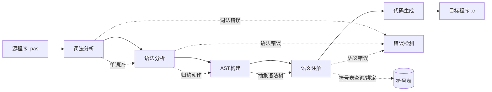

# 编译原理与技术课程设计 - 分析方案

## 一、作业需求分析

### 1.1 核心任务
| 项目 | 要求 |
|------|------|
| **题目** | Pascal-S语言编译程序的设计与实现 |
| **目标** | 将Pascal-S源程序编译成C语言目标程序 |
| **核心模块** | 词法分析、语法分析、语义分析、代码生成、错误处理 |
| **团队规模** | 5人|

### 1.2 评分构成
```
总成绩 (100分)
├── 程序设计+验收答辩 (70分)
│   ├── 平时表现 (5分)
│   ├── 完成功能 (60分)
│   └── 验收答辩 (35分，含在60分内)
└── 设计报告 (30分)
```

### 1.3 必须提交的材料
1. 需求分析报告
2. 总体设计报告（功能模块划分、软件结构图、符号表设计、接口定义）
3. 详细设计报告（各模块功能、输入/输出、处理逻辑）
4. 源代码及可执行程序
5. 测试报告（测试计划、用例、结果分析）
6. 课程设计报告（含个人总结）
7. 答辩PPT

---

## 二、技术方案设计

### 2.1 系统架构


### 2.2 技术选型建议
| 模块 | 推荐技术 | 理由 |
|------|----------|------|
| 词法分析 | **Flex** 或 手工编码 | 文档推荐Flex，自动生成词法分析器 |
| 语法分析 | **Bison/YACC** 或 递归下降 | 文档明确推荐YACC工具 |
| AST中间表示 | **自定义节点层级 + 构建器** | 作为Parser与CodeGen解耦层，降低维护成本 |
| 语义分析 | 语法制导翻译 | 结合符号表进行类型检查 |
| 代码生成 | **Visitor + C语言输出** | 基于AST遍历生成代码，便于单元测试 |
| 符号表 | 哈希表+作用域栈 | 支持嵌套作用域管理 |
| 构建工具 | **CMake** | 平台推荐，便于编译管理 |

### 2.3 Pascal-S语言核心特性
- **程序结构**：program头 + const声明 + var声明 + 过程/函数 + 主程序体
- **数据类型**：integer, real, boolean, char, array
- **语句类型**：赋值、if-else、for、read、write、复合语句
- **过程/函数**：支持递归调用，参数支持传值和传引用
- **文法类型**：LALR(1)文法

---

## 三、五人分工方案

### 3.1 角色分配（推荐）

| 成员 | 角色 | 主要职责 | 工作量占比 |
|------|------|----------|------------|
| **成员1** | 项目组长 | 总体设计、进度管理、集成测试、答辩统筹 | 20% |
| **成员2** | 词法分析负责人 | 词法分析器、单词定义、测试用例设计 | 20% |
| **成员3** | 语法分析负责人 | 语法分析器、文法设计、语法错误处理 | 20% |
| **成员4** | 语义分析负责人 | 符号表、类型检查、语义错误处理 | 20% |
| **成员5** | 代码生成负责人 | 中间代码/目标代码生成、C代码输出 | 20% |

### 3.2 详细任务分解

#### 🔷 成员1（组长）- 总体协调
```
任务清单：
□ 组织需求分析会议，编写需求分析报告
□ 设计系统整体架构和模块接口
□ 制定项目进度计划和里程碑
□ 协调各模块接口对接
□ 负责集成测试和系统联调
□ 组织答辩PPT制作和演练
□ 编写设计报告中的总体设计部分
□ 管理Git仓库和版本控制
```

#### 🔷 成员2 - 词法分析模块
```
任务清单：
□ 定义Pascal-S所有单词类型（关键字、标识符、常数、运算符等）
□ 编写词法分析器（Flex或手工编码）
□ 实现注释处理（{...}格式）
□ 实现错误定位（行号/列号）
□ 设计词法分析测试用例（至少15个）
□ 编写词法分析模块详细设计文档
□ 完成词法分析单元测试
```

#### 🔷 成员3 - 语法分析模块
```
任务清单：
□ 根据文法产生式设计语法分析器
□ 使用Bison/YACC实现或手工递归下降
□ 消除左递归（如采用递归下降）
□ 实现语法错误检测与恢复
□ 构建 AST（定义 Program/Stmt/Expr/Decl 核心节点）
□ 在归约动作中调用 buildTree()，输出 ProgramNode* 根节点
□ 设计语法分析测试用例（至少15个）
□ 编写语法分析模块详细设计文档
□ 完成语法分析单元测试
```

#### 🔷 成员4 - 语义分析模块
```
任务清单：
□ 设计符号表数据结构（支持嵌套作用域）
□ 实现符号表操作（查找、插入、定位、重定位）
□ 实现类型检查（变量、表达式、函数调用）
□ 处理数组维数、参数类型匹配
□ 实现语义错误检测与报告
□ 设计语义分析测试用例（至少15个）
□ 编写语义分析模块详细设计文档
□ 完成语义分析单元测试
```

#### 🔷 成员5 - 代码生成模块
```
任务清单：
□ 设计基于 AST Visitor 的 Pascal-S 到 C 语言映射规则
□ 实现各类语句的代码生成（赋值、if、for等）
□ 实现函数/过程调用的代码生成
□ 处理参数传递（传值/传引用）
□ 实现数组访问的代码生成
□ 读取 AST 节点注解信息（symbolEntry、arrayBounds、paramInfo）
□ 设计代码生成测试用例（至少15个）
□ 编写代码生成模块详细设计文档
□ 完成代码生成单元测试
```

### 3.4 AST 协作接口补充
| 接口 | 提供方 | 调用方 | 说明 |
|------|--------|--------|------|
| `ASTNode* buildTree(NodeType, children)` | 成员3 | 成员3/成员4 | 语法归约时创建并链接节点 |
| `ProgramNode* getParseResultRoot()` | 成员3 | 成员1/成员4/成员5 | 解析完成后返回根节点 |
| `void annotate(ASTNode* root)` | 成员4 | 成员5 | 填充类型与符号表引用 |
| `string generate(ASTNode* root)` | 成员5 | 成员1 | 从已注解 AST 生成 C 代码 |

### 3.3 公共任务（全员参与）
| 任务 | 参与人员 |
|------|----------|
| 需求分析讨论 | 全员 |
| 接口定义会议 | 全员 |
| 集成测试 | 全员 |
| 设计报告编写 | 各自模块+组长统稿 |
| 答辩准备 | 全员（每人讲解自己模块） |
| 测试用例完善 | 全员（共70+测试用例） |

---

## 四、时间线规划（12周）

### 4.1 总体时间轴
```
第1周    第2-3周   第4周    第5-7周   第8周    第9-11周   第12周
 │         │        │         │        │          │         │
 ├─────────┼────────┼─────────┼────────┼──────────┼─────────┤
 │ 任务布置 │ 需求分析 │ 中期检查 │ 编码实现 │ 结题验收 │ 答辩    │
 │ 分组    │ 总体设计 │ 第一次  │ 单元测试 │ 第二次  │ 提交    │
 │         │         │ 交流    │ 集成测试 │ 交流    │         │
```

### 4.2 详细周计划

| 周次 | 阶段 | 主要任务 | 交付物 |
|------|------|----------|--------|
| **第1周** | 启动 | 任务理解、分组、环境搭建 | 分组名单、开发环境 |
| **第2周** | 需求分析 | 需求分析、文法研究、技术选型 | 需求分析报告 |
| **第3周** | 总体设计 | 架构设计、接口定义、符号表设计 | 总体设计报告 |
| **第4周** | 第一次交流 | 设计汇报、进度检查 | PPT、阶段文档 |
| **第5周** | 编码-词法 | 词法分析器实现 | 词法分析模块 |
| **第6周** | 编码-语法 | 语法分析器实现 | 语法分析模块 |
| **第7周** | 编码-语义 | 符号表、类型检查实现 | 语义分析模块 |
| **第8周** | 中期检查 | 详细设计汇报、模块联调 | PPT、详细设计文档 |
| **第9周** | 编码-代码生成 | 代码生成器实现 | 代码生成模块 |
| **第10周** | 集成测试 | 系统联调、Bug修复 | 可运行编译器 |
| **第11周** | 测试完善 | 测试用例完善、报告编写 | 测试报告、设计报告 |
| **第12周** | 验收答辩 | 最终提交、答辩演示 | 全部材料、答辩 |

### 4.3 关键里程碑
| 时间节点 | 里程碑 | 检查点 |
|----------|--------|--------|
| 第2周末 | 需求分析完成 | 需求分析报告 |
| 第3周末 | 总体设计完成 | 总体设计报告、接口定义 |
| 第4周 | 第一次交流 | PPT、阶段成果 |
| 第8周 | 中期检查 | 详细设计、核心模块完成 |
| 第10周末 | 系统集成完成 | 可运行编译器 |
| 第12周 | 结题验收 | 全部材料提交、答辩 |

---

## 五、实施建议

### 5.1 开发环境配置
```bash
# 平台环境（必须兼容）
- Debian GNU/Linux 9
- Flex 2.6.1
- Bison 3.0.4
- CMake 3.28.2
- C++ 7.3.0
- Python 3.7.5
```

### 5.2 代码提交规范
```
可执行文件命名：pascc（小写）
存储位置：/data/workspace/myshixun/bin/
命令行参数：pascc -i filename.pas
输出：同名.c文件在源文件同目录
```

### 5.3 测试策略
| 测试类型 | 数量 | 负责人 |
|----------|------|--------|
| 词法分析测试 | 15+ | 成员2 |
| 语法分析测试 | 15+ | 成员3 |
| 语义分析测试 | 15+ | 成员4 |
| 代码生成测试 | 15+ | 成员5 |
| 集成测试 | 10+ | 成员1 |
| **总计** | **70开放+25隐藏** | 全员 |

### 5.4 风险管控
| 风险 | 应对措施 |
|------|----------|
| 模块接口不一致 | 第3周确定接口规范，定期对接 |
| 进度延误 | 每周进度检查，预留缓冲时间 |
| 测试用例不足 | 尽早开始设计测试用例 |
| 平台环境问题 | 提前熟悉平台，本地环境保持一致 |
| 成员协作问题 | 组长定期组织会议，使用Git管理 |

---

## 六、答辩准备要点

### 6.1 每人需准备
1. 自己负责模块的讲解（3-5分钟）
2. 核心代码演示
3. 回答相关问题

### 6.2 演示内容
- 程序架构及总体功能说明
- 符号表结构及相关函数说明
- 功能演示（词法、语法、类型检查、代码生成）
- 错误检测和处理演示
- 快速排序程序编译运行演示

---

## 七、加分项建议

根据评分标准，以下方面可以争取额外加分：

1. **错误恢复功能**：编译出错后能继续编译
2. **详细错误信息**：准确的错误位置和描述
3. **测试用例完整**：覆盖所有语言特性
4. **代码质量**：规范注释、良好风格
5. **文档质量**：报告规范、图表清晰
6. **功能扩展**：如增加while语句、record类型等

---

如需我进一步帮助分析某个具体模块的设计细节、提供代码框架建议或协助编写文档，请随时告诉我！