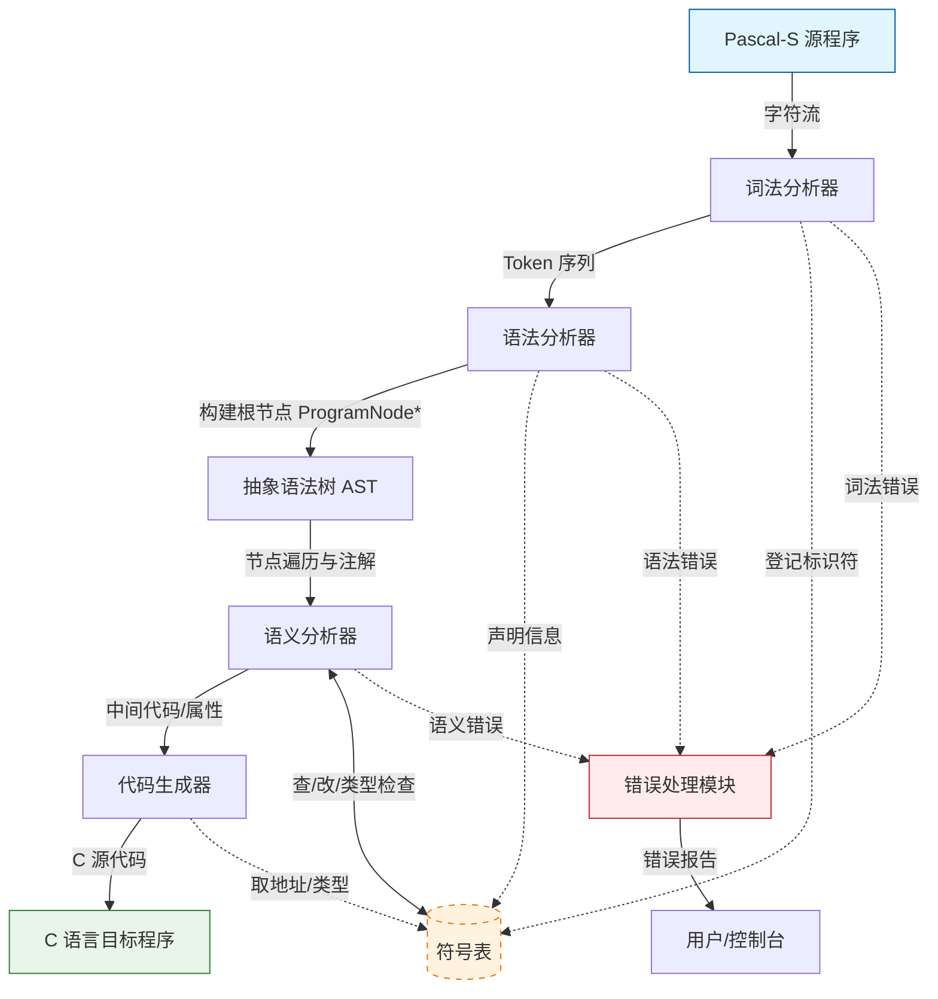

基于《编译原理与技术课程设计》-202601(2).pdf 文档内容，以下是严格符合要求的**需求分析报告**。本报告包含数据流图、功能及数据说明，且所有需求均设计为**可验证**的指标。

---

# 《Pascal-S语言编译程序》需求分析报告

## 1. 引言
### 1.1 项目目标
设计并实现一个将 **Pascal-S** 源程序编译为 **C语言** 目标程序的编译系统。系统需完成词法分析、语法分析、语义分析（含类型检查）、代码生成及错误处理功能。

### 1.2 适用范围
适用于计算机科学与技术等相关专业学生的课程设计，作为《编译原理与技术》课程的实践环节。

---

## 2. 数据流图 (Data Flow Diagram, DFD)

根据文档描述的编译流程，系统的数据流如下：

数据流说明：
1. 输入：Pascal-S 源程序以字符流形式进入词法分析器。
2. 词法分析：输出Token 序列给语法分析器，同时将遇到的标识符名称登记到符号表。
3. 语法分析：按文法归约并构建 AST（根节点 `ProgramNode*`），语法阶段不直接生成 C 代码。若发现结构错误，发送信号给错误处理模块。
4. 语义分析：遍历 AST，与符号表进行双向交互（查找类型、检查兼容性、填入节点属性）。若发现类型错误或未声明变量，发送信号给错误处理模块。通过后将“已注解 AST”传给代码生成器。
5. 代码生成：从符号表获取变量的地址偏移量等信息，最终生成C 语言源代码。
6. 错误处理：收集各阶段的错误信息，格式化后输出错误报告给用户。

---

## 3. 功能需求说明 (Functional Requirements)

所有功能需求均遵循“可验证”原则，即可以通过具体的测试用例进行黑盒或白盒测试。

### 3.1 词法分析模块 (Lexical Analysis)
| 需求编号 | 功能描述 | 验证标准 (Acceptance Criteria) |
| :--- | :--- | :--- |
| **FR-LEX-01** | **单词识别**：能正确识别 Pascal-S 定义的所有单词类型（关键字、标识符、常数、运算符、界符）。 | 输入包含所有类型单词的源程序，输出的 Token 序列类别码和属性值完全正确。 |
| **FR-LEX-02** | **注释处理**：能正确识别并跳过 `{ ... }` 形式的注释，不影响后续分析。 | 输入含多行、嵌套（若支持）或行内注释的程序，编译结果与无注释版本一致。 |
| **FR-LEX-03** | **空白符处理**：正确处理空格、换行、制表符作为分隔符，忽略多余空白。 | 输入格式混乱（多空行、多空格）但语法正确的程序，能正常编译。 |
| **FR-LEX-04** | **词法错误检测**：能识别非法字符、非法数字格式、未闭合字符串等错误。 | 输入含非法字符（如 `@`）的源程序，系统报错并指出**准确的行号和列号**。 |
| **FR-LEX-05** | **大小写不敏感**：标识符和关键字不区分大小写。 | 输入 `VAR`, `var`, `Var` 均被识别为同一关键字；`Count` 和 `count` 视为同一变量。 |

### 3.2 语法分析模块 (Syntax Analysis)
| 需求编号 | 功能描述 | 验证标准 (Acceptance Criteria) |
| :--- | :--- | :--- |
| **FR-SYN-01** | **文法覆盖**：能正确解析文档 1.2 节给出的所有 Pascal-S 文法产生式（程序头、声明、语句、表达式等）。 | 输入文档提供的标准示例程序（如 `sort`, `gcd`），能顺利通过分析，无语法报错。 |
| **FR-SYN-02** | **结构完整性检查**：检查程序结构是否符合 `program_head; program_body.` 格式。 | 输入缺少 `program` 头或末尾缺少 `.` 的程序，报语法错误。 |
| **FR-SYN-03** | **嵌套结构支持**：支持复合语句 (`begin...end`) 的任意层级嵌套。 | 输入深层嵌套（如 5 层以上）的 `if` 或 `for` 语句，能正确解析。 |
| **FR-SYN-04** | **语法错误恢复**：检测到语法错误后，能采取策略（如panic mode）恢复分析，继续发现后续错误。 | 输入含多个语法错误的程序，系统能**一次性列出所有错误**，而不是仅报第一个错误后崩溃。 |
| **FR-SYN-05** | **递归调用支持**：支持过程和函数的递归定义与调用。 | 输入递归函数（如 `gcd` 调用自身），语法分析通过，不报死循环或栈溢出错误（在分析阶段）。 |
| **FR-SYN-06** | **AST 构建能力**：语法分析阶段必须输出结构化 AST 根节点，而非直接拼接目标代码。 | 输入任意合法程序，`yyparse()` 结束后可获取非空 `ProgramNode* root`，并可遍历到关键语句节点（如 `IfStmt`, `AssignStmt`）。 |

### 3.3 语义分析模块 (Semantic Analysis)
| 需求编号 | 功能描述 | 验证标准 (Acceptance Criteria) |
| :--- | :--- | :--- |
| **FR-SEM-01** | **符号表管理**：实现符号表的插入、查找、作用域进入（push）和退出（pop）操作。 | 对于嵌套作用域中的同名变量，能正确区分（局部屏蔽全局）；退出作用域后局部符号不可见。 |
| **FR-SEM-02** | **声明检查**：检查所有使用的标识符是否已声明，禁止重复声明（同一作用域内）。 | 使用未声明变量时报错“标识符未定义”；同一作用域重复定义变量时报错“重复声明”。 |
| **FR-SEM-03** | **类型检查**：检查赋值、运算、函数调用的类型兼容性（integer, real, boolean, char, array）。 | 将 `real` 赋值给 `integer` 变量、布尔值参与算术运算时，报“类型不匹配”错误。 |
| **FR-SEM-04** | **数组维数检查**：检查数组下标是否在定义范围内，维数是否匹配。 | 访问 `a[10]` 而定义为 `array[1..9]` 时，报错“下标越界”（或在运行时检查，编译时需检查类型）。 |
| **FR-SEM-05** | **参数匹配检查**：检查过程/函数调用的实参个数、类型、传递方式（var/value）是否与形参一致。 | 调用 `proc(a)` 而定义为 `proc(var x: integer)` 但传入常量或类型不符时，报错。 |
| **FR-SEM-06** | **AST 语义注解**：在 AST 节点上写入类型、符号表条目及必要的上下文属性。 | 对 `IdentifierNode`、`ArrayAccessNode`、`ProcCallNode` 等节点，注解后其 `dataType` 与 `symbolEntry` 非空且与符号表一致。 |

### 3.4 代码生成模块 (Code Generation)
| 需求编号 | 功能描述 | 验证标准 (Acceptance Criteria) |
| :--- | :--- | :--- |
| **FR-COD-01** | **目标语言映射**：将 Pascal-S 程序正确转换为等效的 C 语言代码。 | 生成的 `.c` 文件语法正确，能被 GCC 编译器编译通过。 |
| **FR-COD-02** | **控制流转换**：正确转换 `if-then-else`, `for-do`, `begin-end` 结构为 C 的对应结构。 | 运行生成的 C 程序，其逻辑分支和循环次数与 Pascal-S 源程序预期一致。 |
| **FR-COD-03** | **数据类型转换**：处理 Pascal-S 到 C 的类型映射（如 `integer`->`int`, `real`->`double`）。 | 生成的 C 代码中变量类型声明正确，运算结果精度符合预期。 |
| **FR-COD-04** | **数组与指针处理**：正确生成数组访问代码，处理传引用参数（C 指针）。 | 生成的 C 代码中，`var` 参数通过指针传递，修改形参能影响实参。 |
| **FR-COD-05** | **完整程序生成**：生成的 C 程序包含必要的头文件和 `main` 函数入口。 | 生成的 C 文件独立编译链接后可执行，无需人工修改。 |
| **FR-COD-06** | **基于 AST 的代码生成**：代码生成器必须以 AST 为输入，并通过节点访问生成 C 代码。 | 在不修改 `parser.y` 的前提下，仅调整 `CodeGenerator` 访问信息即可完成某类输出格式改造，验证前后端解耦。 |

### 3.5 错误处理模块 (Error Handling)
| 需求编号 | 功能描述 | 验证标准 (Acceptance Criteria) |
| :--- | :--- | :--- |
| **FR-ERR-01** | **错误定位**：所有错误报告必须包含文件名、行号、列号。 | 任意错误发生时，输出格式为 `Error at line X, col Y: description`。 |
| **FR-ERR-02** | **错误描述清晰**：提供人类可读的错误原因描述。 | 错误信息不包含内部代码（如 "State 54 error"），而是 "Unexpected token 'else'"。 |
| **FR-ERR-03** | **多错误容忍**：在一次编译过程中尽可能多地报告错误。 | 输入含 5 个独立错误的程序，输出至少 3 个以上的错误报告。 |

---

## 4. 数据需求说明 (Data Requirements)

### 4.1 输入数据
*   **格式**：纯文本文件，扩展名 `.pas`。
*   **编码**：ASCII 或 UTF-8。
*   **内容约束**：必须符合 Pascal-S 文法结构（Program head, Const, Var, Subprogram, Compound statement）。
*   **规模限制**：支持至少 500 行代码的程序编译（性能验证）。

### 4.2 输出数据
*   **目标代码**：
    *   **格式**：纯文本文件，扩展名 `.c`。
    *   **位置**：默认与源文件同目录，或指定输出路径。
    *   **内容**：符合 C89/C99 标准的源代码。
*   **错误日志**：
    *   **格式**：标准输出 (stdout) 或标准错误 (stderr)。
    *   **内容**：结构化错误信息列表。

### 4.3 内部数据结构 (符号表)
符号表是核心数据对象，必须包含以下字段（可验证点）：
| 字段名 | 类型 | 说明 | 验证方法 |
| :--- | :--- | :--- | :--- |
| **Name** | String | 标识符名称 | 查询时精确匹配 |
| **Kind** | Enum | 种类 (Const, Var, Proc, Func, Param) | 检查语义动作是否正确区分 |
| **Type** | Enum/Struct | 数据类型 (Integer, Real, Array等) | 类型检查时读取该字段 |
| **ScopeLevel** | Int | 作用域层级 (0为全局) | 验证嵌套作用域屏蔽规则 |
| **Offset** | Int | 相对地址/栈偏移 | 代码生成时用于生成变量访问代码 |
| **ArrayInfo** | Struct | (可选) 上下界、元素类型 | 数组访问时验证维数 |
| **ParamList** | List | (可选) 函数参数列表 | 函数调用时验证参数匹配 |

### 4.4 内部数据结构 (AST)
AST 是语法分析和代码生成之间的中间表示，至少包含以下可验证字段：

| 字段名 | 类型 | 说明 | 验证方法 |
| :--- | :--- | :--- | :--- |
| **NodeType** | Enum | 节点类别（Program、Stmt、Expr、Decl 等） | 遍历树时可区分节点语义角色 |
| **Children** | List<ASTNode*> | 子节点列表 | 对复合语句、表达式树做 DFS 验证层次关系 |
| **DataType** | Enum | 语义阶段推导出的类型 | 类型检查后读取字段验证结果一致性 |
| **SymbolEntryRef** | Pointer | 绑定到符号表条目 | 标识符/过程调用节点可回溯到声明项 |
| **SourcePos** | Struct | 行列号位置信息 | 报错时定位与节点位置信息一致 |

---

## 5. 非功能需求 (Non-Functional Requirements)

| 需求编号 | 需求类型 | 描述 | 验证标准 |
| :--- | :--- | :--- | :--- |
| **NFR-01** | **可靠性** | 编译器在遇到非法输入时不应崩溃（Crash）。 | 输入任意随机字符或畸形代码，程序能捕获错误并优雅退出或继续分析。 |
| **NFR-02** | **可移植性** | 能够在 Debian Linux 环境下编译和运行。 | 在指定的 Docker 容器或虚拟机中成功编译并运行测试用例。 |
| **NFR-03** | **规范性** | 代码风格符合 C++ 规范，注释清晰。 | 代码审查（Code Review）通过，关键函数有注释。 |
| **NFR-04** | **文档一致性** | 设计报告与实际代码功能一致。 | 验收答辩时，演示的功能必须在设计报告中有对应描述。 |

---

## 6. 测试验证计划概要

为确保上述需求可验证，将执行以下测试策略：
1.  **单元测试**：针对词法分析器（每个 Token 类型）、符号表操作（插入/查找/作用域）编写独立测试用例。
2.  **集成测试**：
    *   **正确性测试**：使用文档提供的 `example.pas` 和自写的 `quicksort.pas`，验证生成的 C 代码能否运行且结果正确。
    *   **错误注入测试**：构造包含词法错误、语法错误、语义错误（类型不匹配、未声明）的特定用例，验证报错信息的准确性和鲁棒性。
3.  **回归测试**：每次修改代码后，重新运行所有测试用例，确保无新 Bug 引入。

---
*注：本需求分析严格依据《编译原理与技术课程设计》-202601(2).pdf 文档第 9-34 页的任务说明、文法定义及课程设计建议编写。*